# Unit 1: Basic Electrical Quantities, Components, and Sources

A torch, a ceiling fan, a mobile charger, and a water pump all raise the same underlying questions: what pushes charge through a circuit, what flows, why a component heats, and why a battery voltage falls when loaded. This chapter builds the vocabulary needed to answer them. It defines the basic electrical quantities — EMF, current, potential difference, power, and energy — introduces the three passive components (resistor, capacitor, inductor), distinguishes DC, AC, and pulsating signals, and develops the ideal and practical source models used in the rest of the book.

## 1.1 Basic Electrical Quantities

### EMF and potential difference

A source such as a cell, battery, or generator supplies energy to electric charges. The energy delivered per unit charge is the **electromotive force** (EMF), measured in volts. EMF is not a mechanical force; the name is historical. If a source supplies energy $W$ joules to a charge $Q$ coulombs,

$$
V = \frac{W}{Q} \tag{1.1}
$$

One volt equals one joule per coulomb.

The **potential difference** between two points is the difference in electric potential between them. In circuit work, a voltmeter placed across a resistor, lamp, or battery terminal reads the potential difference between those points. EMF refers specifically to the source; potential difference refers to the voltage between any two points in a circuit. The numerical values may coincide in simple problems, but the terms are not interchangeable.

Figure 1.1 contrasts the EMF provided by the source with the potential difference across the lamp and shows the two current conventions.

<figure style="text-align: center; margin: 1.5rem auto;">
  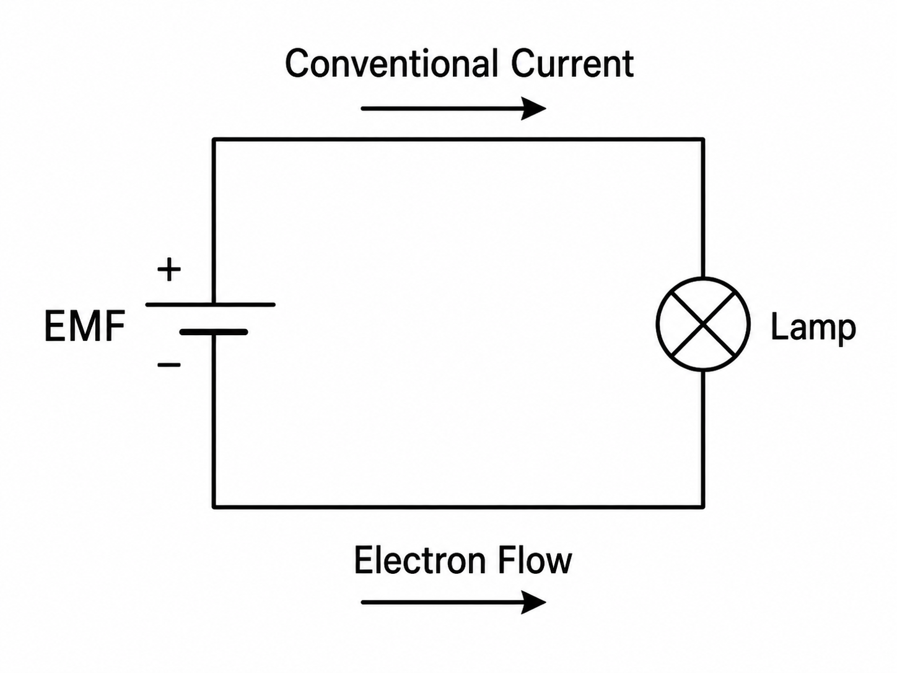
  <figcaption style="font-size: 0.85em; color: #555; margin-top: 0.5rem;">Figure 1.1: Simple battery-lamp circuit showing source EMF, lamp, conventional current direction, and electron flow.</figcaption>
</figure>

### Electric current

Current is the flow of electric charge through a conductor. If a charge $Q$ passes a cross-section in time $t$,

$$
I = \frac{Q}{t} \tag{1.2}
$$

One ampere equals one coulomb per second. In metals the carriers are electrons; in electrolytes and semiconductors the carriers differ, but for circuit analysis only the net rate of charge transfer matters.

### Power and energy

A lamp glows, a heater warms, and a motor turns because electrical energy is converted to other forms. The rate of this conversion is the **electric power**. For a DC circuit,

$$
P = VI \tag{1.3}
$$

with $P$ in watts. **Electrical energy** is the time-integral of power. For constant $P$ over time $t$,

$$
W = Pt = VIt \tag{1.4}
$$

In SI, energy is in joules when $P$ is in watts and $t$ in seconds. For longer durations, energy is usually expressed in watt-hour or kilowatt-hour:

$$
1~\text{Wh} = 3600~\text{J}, \qquad 1~\text{kWh} = 3.6 \times 10^{6}~\text{J} \tag{1.5}
$$

The kWh on an electricity bill is a unit of energy, not power.

**Table 1.1 Basic electrical quantities**

| Quantity | Symbol | SI unit | Meaning |
|---|---:|---:|---|
| EMF / voltage | $V$ or $\mathcal{E}$ | volt (V) | energy per unit charge |
| Current | $I$ | ampere (A) | rate of flow of charge |
| Power | $P$ | watt (W) | rate of energy transfer |
| Energy | $W$ or $E$ | joule (J) | total electrical work done |
| Charge | $Q$ | coulomb (C) | quantity of electricity |

#### Worked Example 1.1

A 12 V battery supplies 0.5 A to a lamp for 3 hours. Find the power and the energy consumed.

$$
P = VI = 12 \times 0.5 = 6~\text{W}
$$

With $t = 3~\text{h} = 10{,}800~\text{s}$,

$$
W = Pt = 6 \times 10{,}800 = 64{,}800~\text{J} = 18~\text{Wh}
$$

#### Worked Example 1.2

A 230 V table fan draws 0.25 A. Estimate its input power.

$$
P = VI = 230 \times 0.25 = 57.5~\text{W}
$$

This is a first estimate. For AC loads the true average power also depends on the power factor, as shown in the AC chapter.

A final caution on measurement: a voltmeter is connected across a component, an ammeter in series with it. Reversing these connections is the most common cause of blown multimeter fuses in the laboratory.

Figure 1.2 shows the correct multimeter connection and the most common wrong arrangement to avoid.

<figure style="text-align: center; margin: 1.5rem auto;">
  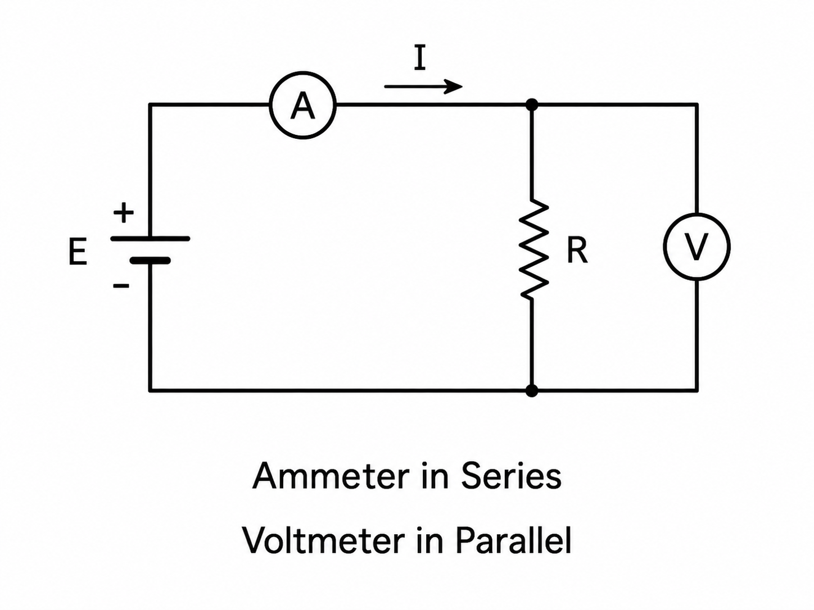
  <figcaption style="font-size: 0.85em; color: #555; margin-top: 0.5rem;">Figure 1.2: Ammeter connected in series and voltmeter connected in parallel across the resistor.</figcaption>
</figure>

## 1.2 Passive Components

The resistor, capacitor, and inductor are **passive** components because they do not generate electrical energy. They are the elements used to control current, store energy, and shape signal behaviour in every circuit that follows.

### Resistor

A **resistor** opposes current, and its opposition is called **resistance** $R$, measured in ohms ($\Omega$). For a linear resistor, Ohm's law relates voltage and current:

$$
V = IR \tag{1.6}
$$

The power dissipated in a resistor can be written in three equivalent forms that follow from Ohm's law together with $P = VI$:

$$
P = VI = I^{2}R = \frac{V^{2}}{R} \tag{1.7}
$$

A resistor converts this power almost entirely into heat. Resistors are used for current limiting, voltage division, transistor biasing, and deliberate heat generation in appliances such as irons and geysers.

#### Fixed and variable resistors

A **fixed resistor** has a single nominal value set at manufacture. A **variable resistor** can be adjusted during use. The common variable types are the **potentiometer**, a three-terminal device used as an adjustable voltage divider; the **rheostat**, a two-terminal device used for current control; and the **preset** or **trimmer**, a small in-circuit device used for factory or field calibration. Fixed resistors dominate in practical circuits; variable resistors are reserved for functions that genuinely need manual adjustment, such as volume, tuning, sensitivity, or calibration.

#### Ratings and tolerance

A resistor is selected for three parameters: resistance value, **power rating**, and **tolerance**. Common small through-hole power ratings are 0.125 W, 0.25 W, 0.5 W, and 1 W; a comfortable margin between calculated dissipation and rated dissipation extends service life. Tolerance specifies the maximum allowed deviation from the nominal value: a 1 kΩ resistor at ±5 % may measure between 950 Ω and 1050 Ω, while a 10 kΩ resistor at ±1 % lies between 9.9 kΩ and 10.1 kΩ. Standard colour-band coding identifies nominal value and tolerance at a glance; a worked reading of the code is given at the end of this chapter.

#### Temperature effect

The resistance of a real resistor is not strictly constant with temperature. In most metallic resistors, resistance rises slightly as temperature rises, because increased lattice vibration scatters the conduction electrons more strongly. This behaviour is summarised by the temperature coefficient of resistance. It is negligible in low-power beginner problems but matters for precision instrumentation, high-current paths where self-heating is significant, and circuits required to be stable over a wide ambient range.

#### Voltage divider

Two resistors in series across a source act as a **voltage divider**. With $R_1$ and $R_2$ in series across a source $V_s$, the same current

$$
I = \frac{V_s}{R_1 + R_2}
$$

flows through both, so the voltage across $R_2$ is

$$
V_{out} = \frac{R_2}{R_1 + R_2}\, V_s \tag{1.8}
$$

For example, with $V_s = 12$ V, $R_1 = 2~\text{k}\Omega$, and $R_2 = 1~\text{k}\Omega$,

$$
V_{out} = \frac{1}{2+1} \times 12 = 4~\text{V}
$$

The divider relation is one of the most frequently used small formulas in introductory electronics, appearing in transistor biasing, sensor reference networks, and signal conditioning.

Figure 1.3 shows the divider tap and the reference to ground explicitly.

<figure style="text-align: center; margin: 1.5rem auto;">
  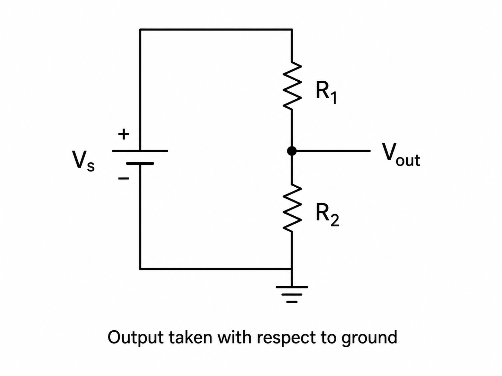
  <figcaption style="font-size: 0.85em; color: #555; margin-top: 0.5rem;">Figure 1.3: Voltage divider with output Vout taken from the junction of R1 and R2 with respect to ground.</figcaption>
</figure>

#### Worked Example 1.3

A 10 V source is connected across a 2 kΩ resistor. Find the current and the power dissipated.

$$
I = \frac{V}{R} = \frac{10}{2000} = 5~\text{mA}
$$

$$
P = VI = 10 \times 0.005 = 0.05~\text{W}
$$

A 0.25 W resistor is a safe practical choice for this dissipation.

### Capacitor

A **capacitor** stores energy in the electric field between two conducting surfaces separated by a dielectric. The fundamental relation is

$$
C = \frac{Q}{V} \tag{1.9}
$$

where $C$ is in farads, $Q$ in coulombs, and $V$ is the voltage across the capacitor. Capacitance measures the charge stored per volt. The energy stored is

$$
W_C = \frac{1}{2} C V^{2} \tag{1.10}
$$

Figure 1.4 links the field-based picture of capacitance with the polarity marking that matters for electrolytic capacitors.

<figure style="text-align: center; margin: 1.5rem auto;">
  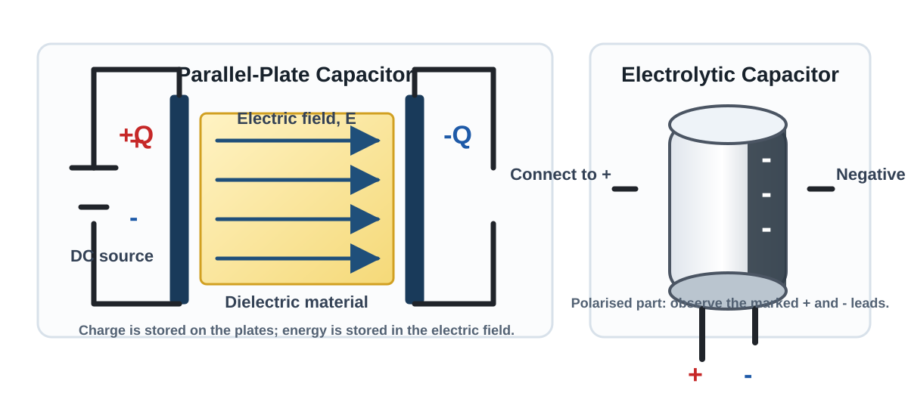
  <figcaption style="font-size: 0.85em; color: #555; margin-top: 0.5rem;">Figure 1.4: Parallel-plate capacitor showing dielectric and electric field lines beside an electrolytic capacitor polarity sketch.</figcaption>
</figure>

When a capacitor is connected to a DC source through a resistor, the charging current is maximum at the first instant and falls as the capacitor voltage rises. The process is governed by the **time constant**

$$
\tau = RC \tag{1.11}
$$

with $R$ in ohms, $C$ in farads, and $\tau$ in seconds. Larger $R$ or larger $C$ gives slower charging and discharging; after roughly five time constants the transient is practically complete. A fully charged capacitor in an ideal DC circuit passes no further current and behaves as an open circuit. In AC circuits the voltage changes continuously, so a capacitor repeatedly charges and discharges, and current flows in the branch at all times.

Figure 1.5 shows the charging and discharging transients, with $\tau$ and $5\tau$ marked on the time axis.

<figure style="text-align: center; margin: 1.5rem auto;">
  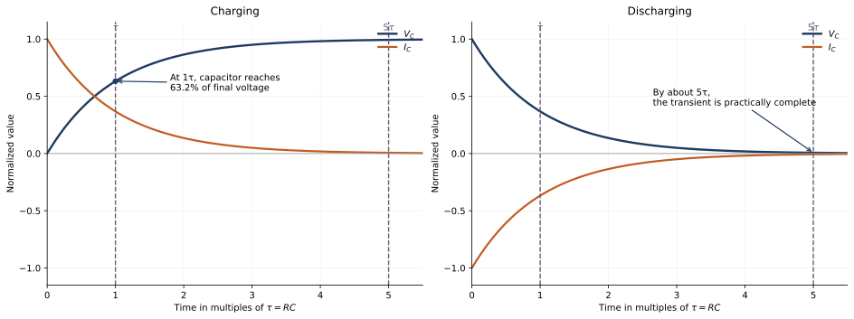
  <figcaption style="font-size: 0.85em; color: #555; margin-top: 0.5rem;">Figure 1.5: RC charging and discharging curves for capacitor voltage and current, with tau and five tau indicated.</figcaption>
</figure>

Typical applications include smoothing of rectifier outputs, AC coupling between stages, bypassing of supply noise, timing networks, and power-factor correction.

#### Capacitor types and polarity

Different dielectrics suit different duties. **Ceramic** capacitors are small, non-polarised, and dominate in decoupling and high-frequency bypassing. **Electrolytic** capacitors offer high capacitance in a small volume but are polarised and must be connected with the correct polarity; reverse connection beyond the rated reverse voltage can cause heating, leakage, or violent failure. **Film** capacitors are stable and reliable, favoured in AC, audio, timing, and motor-run applications. **Mica** and other specialist capacitors are used where stability or high-frequency performance is critical. Selection therefore depends on voltage rating, polarity, tolerance, intended AC or DC duty, and the physical and thermal environment — not on capacitance value alone.

#### Worked Example 1.4

A 1000 μF capacitor is charged to 12 V. Find the energy stored.

$$
C = 1000 \times 10^{-6}~\text{F} = 10^{-3}~\text{F}
$$

$$
W_C = \tfrac{1}{2} C V^{2} = \tfrac{1}{2} \times 10^{-3} \times 144 = 0.072~\text{J}
$$

The value is small compared with battery energy but is routinely exploited in smoothing and short-term hold-up applications.

### Inductor

An **inductor** is a coil that stores energy in the magnetic field set up by its current. The voltage across an ideal inductor is proportional to the rate of change of current:

$$
v = L\,\frac{di}{dt} \tag{1.12}
$$

with $L$ in henrys. The inductor therefore opposes changes in current: a rapid attempt to change $i$ produces a large opposing $v$. The energy stored is

$$
W_L = \tfrac{1}{2} L I^{2} \tag{1.13}
$$

Inductance depends on the number of turns, coil geometry, magnetic path length, and core material. **Air-core** inductors avoid core losses and suit higher-frequency use. **Iron-core** inductors give high inductance per turn at power frequencies. **Ferrite-core** inductors dominate in modern electronic equipment because ferrites combine useful permeability with low high-frequency loss.

A practical coil is made of wire with finite resistance $R_w$, and so dissipates $P_{cu} = I^{2} R_w$ in copper loss. This is why an apparently inductive coil still warms in service. In a magnetic-core inductor, increasing current eventually drives the core into **saturation**, where flux no longer rises in proportion to current. Inductance falls, current may rise more steeply than the design predicts, and additional heating results. Saturation is a central concern for power inductors, transformers, relays, and magnetic actuators; Unit 2 examines its magnetic origin.

Figure 1.6 combines the magnetic-field picture of a coil with the idea of back EMF during current change.

<figure style="text-align: center; margin: 1.5rem auto;">
  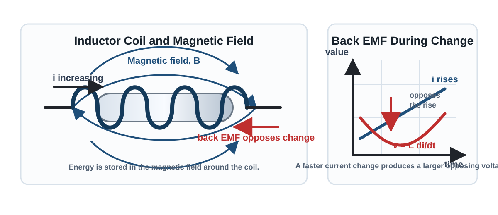
  <figcaption style="font-size: 0.85em; color: #555; margin-top: 0.5rem;">Figure 1.6: Inductor coil with magnetic field lines and a back-EMF sketch showing opposition to rising current.</figcaption>
</figure>

#### Worked Example 1.5

An inductor of 20 mH carries a current of 2 A. Find the stored energy.

$$
W_L = \tfrac{1}{2} L I^{2} = \tfrac{1}{2} \times 0.02 \times 4 = 0.04~\text{J}
$$

**Table 1.2 Comparison of the three passive components**

| Component | Main effect | Unit | Stores energy in | Steady-DC behaviour | Common use |
|---|---|---:|---|---|---|
| Resistor | opposes current | $\Omega$ | none (ideally) | $V = IR$ | current limiting, voltage division |
| Capacitor | opposes change in voltage | F | electric field | open circuit once charged | filtering, coupling, timing |
| Inductor | opposes change in current | H | magnetic field | short circuit once settled | chokes, coils, filters |

Resistor values can be read from colour bands and verified with a multimeter; capacitance and inductance are measured with an LCR meter, which is why the LCR meter is a standard instrument in the FEEE laboratory.

## 1.3 Signal Waveforms

A **waveform** is the pattern by which a voltage or current varies with time. A battery produces nearly steady DC; a rectifier output before filtering produces pulsating DC; the mains supply produces AC; a switching transient produces a single non-repeating event.

### DC, pulsating DC, and AC

A **DC signal** has a single polarity. Steady DC has constant magnitude as well; pulsating DC varies in magnitude but never reverses polarity. An **AC signal** changes both in magnitude and polarity, reversing direction periodically. The Indian single-phase domestic supply is 230 V at 50 Hz. The distinction matters because a rectifier output before the smoothing capacitor is neither pure AC nor steady DC — it is pulsating DC.

### Periodic and non-periodic waveforms

A waveform is **periodic** if it repeats after a fixed time interval $T$, called the **time period**. Its **frequency** is

$$
f = \frac{1}{T} \tag{1.14}
$$

measured in hertz. At 50 Hz the period is $T = 1/50 = 20~\text{ms}$, so one mains cycle occupies 20 ms. A **non-periodic** waveform has no regular repetition — a one-shot discharge, a switching transient, or a random sensor event are typical examples.

### Amplitude, peak-to-peak value, and DC offset

The **amplitude** of a waveform is its maximum departure from the reference level. A sine wave swinging between $+10$ V and $-10$ V has an amplitude of 10 V and a peak-to-peak value of 20 V. The **peak-to-peak value** is always the total swing between the extreme values, regardless of whether the waveform crosses zero: a signal that varies between 2 V and 8 V has $V_{pp} = 6~\text{V}$. The **DC offset** is the displacement of the waveform's average value from zero; the 2–8 V signal above has an offset of 5 V.

An oscilloscope displays voltage against time, with the vertical scale set in volts per division and the horizontal scale in seconds per division. Both scale settings must be read before interpreting any trace, as otherwise a correct waveform can appear misleading.

### Waveform families

A **sine wave** varies smoothly and periodically. It is central to power engineering because rotating alternators produce it naturally and because AC circuit analysis takes its simplest form for sinusoids. A **square wave** alternates sharply between two levels and is the workhorse of digital circuits and clock signals. A **triangular wave** rises and falls linearly and is used in timing and waveform generation. A **sawtooth wave** rises linearly and then resets rapidly, appearing in scan and sweep circuits. A **pulse** sits at one level for a defined time and then briefly switches to another; repeated pulses drive digital control, triggering, communication, and switched power conversion.

Figure 1.7 compares the common beginner waveform families and marks amplitude, peak-to-peak value, period, frequency, DC offset, and duty cycle on representative traces.

<figure style="text-align: center; margin: 1.5rem auto;">
  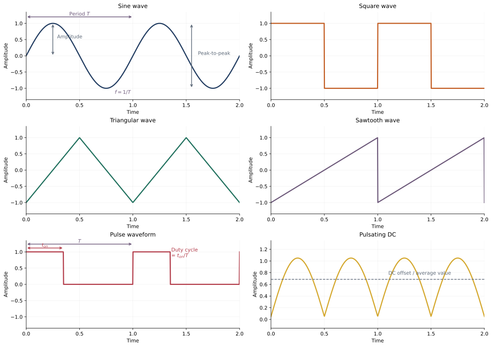
  <figcaption style="font-size: 0.85em; color: #555; margin-top: 0.5rem;">Figure 1.7: Common waveform families including sine, square, triangular, sawtooth, pulse, and pulsating DC with amplitude, peak-to-peak value, period, frequency, DC offset, and duty-cycle annotations.</figcaption>
</figure>

### Duty cycle

For pulse and square waveforms, the **duty cycle** is the fraction of one period spent in the high state,

$$
D = \frac{t_{on}}{T} \times 100\,\% \tag{1.15}
$$

A pulse high for 2 ms in every 10 ms period has a duty cycle of 20 %. Duty cycle is central to digital signalling, motor speed control, DC–DC conversion, and pulse-width-modulated power delivery.

#### Worked Example 1.6

A waveform repeats every 5 ms. Find its frequency.

$$
f = \frac{1}{T} = \frac{1}{5 \times 10^{-3}} = 200~\text{Hz}
$$

#### Worked Example 1.7

A pulse waveform has a period of 8 ms and a high-state time of 3 ms. Find the duty cycle.

$$
D = \frac{3}{8} \times 100\,\% = 37.5\,\%
$$

#### Worked Example 1.8

A DSO is set to 5 ms/div and one complete cycle occupies four horizontal divisions. Find the frequency.

$$
T = 4 \times 5~\text{ms} = 20~\text{ms}, \qquad f = \frac{1}{0.02} = 50~\text{Hz}
$$

**Table 1.3 Simple waveform classification**

| Signal type | Repeats regularly? | Polarity | Example |
|---|---|---|---|
| Steady DC | no time variation | one polarity | dry cell, regulated 5 V supply |
| Pulsating DC | often periodic | one polarity | rectifier output before smoothing |
| AC periodic | yes | changes polarity | 230 V, 50 Hz mains |
| Non-periodic | no | may vary | transient pulse, switching event |

Not every AC waveform is sinusoidal — a square wave that alternates in polarity is equally AC — and not every DC signal is flat, as pulsating DC demonstrates. Frequency and amplitude describe independent properties: frequency is how often the pattern repeats, amplitude is how large each cycle is.

## 1.4 Sources

Every practical circuit needs an energy source — a battery, bench supply, rectifier, generator, solar module, or signal generator. For analysis these are replaced by idealised source models, because no real source is perfect and explicit modelling of the imperfection is essential when the imperfection matters.

Figure 1.8 summarises the ideal and practical voltage-source and current-source models used throughout this section.

<figure style="text-align: center; margin: 1.5rem auto;">
  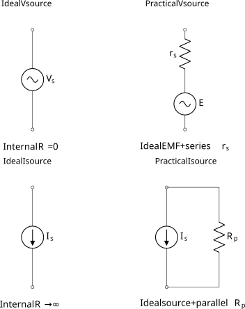
  <figcaption style="font-size: 0.85em; color: #555; margin-top: 0.5rem;">Figure 1.8: Side-by-side ideal and practical voltage-source and current-source equivalent circuits.</figcaption>
</figure>

### Ideal and practical voltage sources

An **ideal voltage source** holds its terminal voltage constant for any load current; its internal resistance is zero. A real source always has a finite internal resistance $r_s$, and is modelled as an ideal EMF $\mathcal{E}$ in series with $r_s$. For a load current $I$,

$$
V = \mathcal{E} - I\,r_s \tag{1.16}
$$

The drop $I r_s$ inside the source is why a battery terminal voltage sags when the load is heavy.

### Terminal characteristic

The **open-circuit voltage** is the terminal voltage when no load current is drawn; for the practical voltage source this equals $\mathcal{E}$. The **short-circuit current** is the current that would flow if the terminals were bridged by an ideal short:

$$
I_{sc} = \frac{\mathcal{E}}{r_s} \tag{1.17}
$$

This is a fault condition, not a design point; in real sources it is limited by internal construction, wiring resistance, protection devices, and thermal response. Equation (1.16) plots as a straight line on axes of $V$ against $I$: terminal voltage $\mathcal{E}$ at $I = 0$, falling with slope $-r_s$ and reaching zero at $I = I_{sc}$. This **terminal characteristic** captures the no-load, loaded, and fault behaviour in a single diagram.

Figure 1.9 plots the terminal characteristic of a practical voltage source.

<figure style="text-align: center; margin: 1.5rem auto;">
  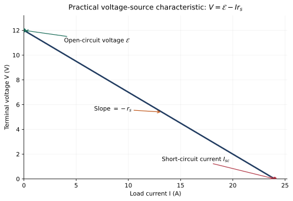
  <figcaption style="font-size: 0.85em; color: #555; margin-top: 0.5rem;">Figure 1.9: Terminal characteristic V = E - I rs of a practical voltage source, showing open-circuit voltage, short-circuit current, and the slope -rs.</figcaption>
</figure>

### Load regulation

**Load regulation** describes how much the terminal voltage changes between no-load and full-load. A well-regulated source holds its voltage nearly constant as the load current varies; a poorly regulated source shows a pronounced droop. The effect is important in batteries under heavy discharge, bench DC supplies, adapters, chargers, and any regulated electronic power supply. A battery that reads 12 V on open circuit may deliver noticeably less when supplying a motor — that is load regulation in action.

Figure 1.10 visualises the voltage droop from no-load to full-load.

<figure style="text-align: center; margin: 1.5rem auto;">
  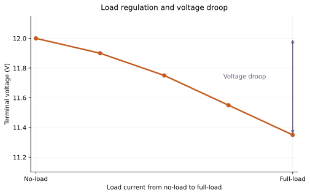
  <figcaption style="font-size: 0.85em; color: #555; margin-top: 0.5rem;">Figure 1.10: Small voltage-droop graph showing terminal voltage falling from no-load to full-load.</figcaption>
</figure>

#### Worked Example 1.9

A battery of EMF 12 V and internal resistance 0.5 Ω supplies 2 A to a load. Find the terminal voltage.

$$
V = 12 - (2 \times 0.5) = 11~\text{V}
$$

### Ideal and practical current sources

An **ideal current source** holds its output current constant for any terminal voltage; its internal resistance is infinite. A practical current source is modelled as an ideal current source in parallel with a large internal resistance $R_p$. The parallel placement is the correct choice because a large parallel resistance diverts very little of the source current away from the load. Current sources appear naturally in transistor bias networks, current mirrors, and sensor interfaces, even when no explicit current-source symbol appears in the final schematic.

#### Worked Example 1.10

An ideal 10 mA current source drives a 500 Ω load. Find the load voltage.

$$
V = IR = 0.01 \times 500 = 5~\text{V}
$$

The current is fixed by the source; the voltage adjusts to whatever the load requires.

### Source transformation

A practical voltage source can be replaced by an equivalent practical current source and vice versa. If a voltage source $\mathcal{E}$ is in series with resistance $R$, the equivalent current-source form is

$$
I_s = \frac{\mathcal{E}}{R} \tag{1.18}
$$

in parallel with the same resistance $R$. Conversely,

$$
\mathcal{E} = I_s R \tag{1.19}
$$

The series resistance in one form becomes the parallel resistance in the other; its value is unchanged. **Source transformation** is a mathematical manoeuvre on the model, not a physical change to the source: the external behaviour at the terminals is identical in both forms, and one form is often easier to analyse than the other.

Figure 1.11 shows the voltage-source and current-source forms feeding the same load.

<figure style="text-align: center; margin: 1.5rem auto;">
  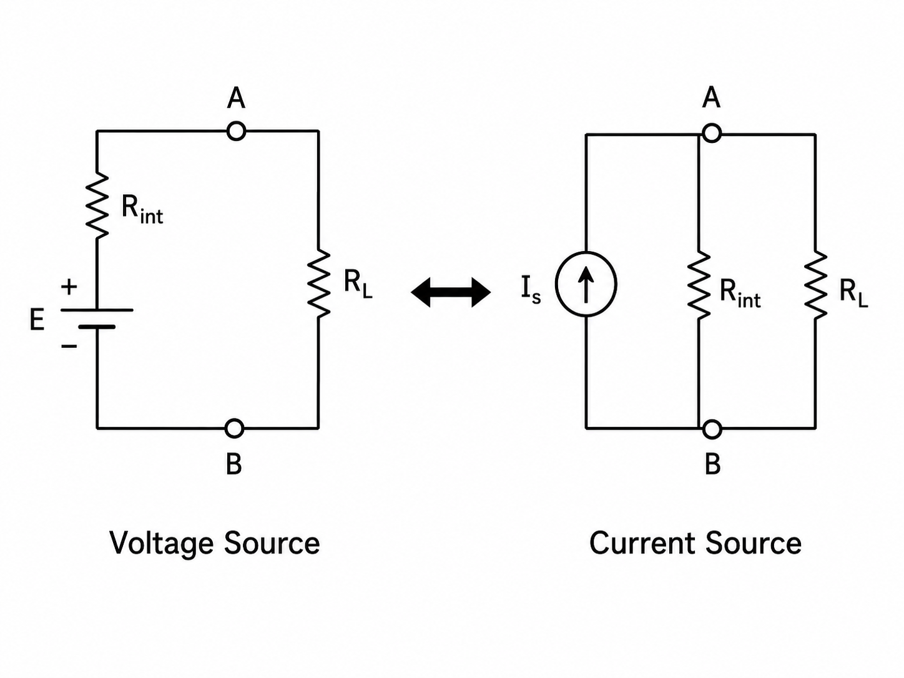
  <figcaption style="font-size: 0.85em; color: #555; margin-top: 0.5rem;">Figure 1.11: Equivalent voltage-source and current-source forms connected to the same load.</figcaption>
</figure>

#### Worked Example 1.11

Transform a 12 V source in series with 6 Ω into its equivalent current-source form.

$$
I_s = \frac{12}{6} = 2~\text{A}
$$

The equivalent is a 2 A current source in parallel with 6 Ω.

#### Worked Example 1.12

Connect the source of Example 1.11 to a 3 Ω load and find the load current by both forms.

*Voltage-source form.* Total loop resistance is $6 + 3 = 9~\Omega$, so

$$
I = \frac{12}{9} = 1.333~\text{A}
$$

*Current-source form.* The 6 Ω internal and 3 Ω load appear in parallel:

$$
R_{eq} = \frac{6 \times 3}{6 + 3} = 2~\Omega, \qquad V = I_s R_{eq} = 2 \times 2 = 4~\text{V}
$$

$$
I_L = \frac{V}{R_L} = \frac{4}{3} = 1.333~\text{A}
$$

Both forms give the same load current, confirming the equivalence.

**Table 1.4 Ideal and practical source models**

| Source type | Ideal internal resistance | Practical form | Intended behaviour |
|---|---:|---|---|
| Voltage source | $0~\Omega$ | ideal EMF in series with small $r_s$ | constant terminal voltage |
| Current source | infinite | ideal current source in parallel with large $R_p$ | constant output current |

An ideal voltage source is defined by constancy of voltage, not by the voltage being large; likewise an ideal current source is defined by constancy of current. No real source maintains its rated value under every condition, which is the practical reason internal resistance appears in the model at all.

## Worked Interpretation Exercise: Reading the Resistor Colour Code

The standard four-band resistor colour code encodes two significant digits, a decimal multiplier, and a tolerance. Consider a resistor with bands **Brown – Black – Red – Gold**. Using the Vishay chart [Vishay, *Color Code and Standard Resistance Series*](https://www.vishay.com/docs/20143/colorcod.pdf):

Figure 1.12 summarises the four-band resistor colour code and shows a worked colour-band example.

<figure style="text-align: center; margin: 1.5rem auto;">
  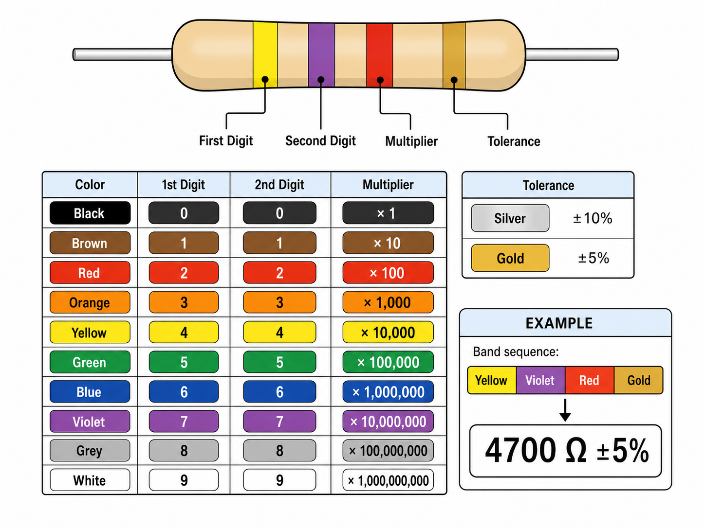
  <figcaption style="font-size: 0.85em; color: #555; margin-top: 0.5rem;">Figure 1.12: Four-band resistor colour-code chart with digit, multiplier, tolerance, and worked example.</figcaption>
</figure>

- Brown gives the first digit, 1.
- Black gives the second digit, 0.
- Red is the multiplier, $10^{2}$.
- Gold is the tolerance, $\pm 5\,\%$.

The nominal value is therefore

$$
R = 10 \times 10^{2} = 1000~\Omega = 1~\text{k}\Omega
$$

A tolerance of $\pm 5\,\%$ allows an actual value in the range

$$
R_{min} = 1000 - 50 = 950~\Omega, \qquad R_{max} = 1000 + 50 = 1050~\Omega
$$

A multimeter reading of 0.99 kΩ on the resistor, measured out of circuit, is consistent with the code. This exercise links component marking, nominal value, manufacturing tolerance, and measured value in a single practical task, and is a laboratory skill worth developing early.

## Chapter Summary

- EMF is the energy delivered per unit charge by a source: $V = W/Q$. Potential difference is the voltage between two points in a circuit.
- Current is the rate of flow of charge, $I = Q/t$; power in a DC circuit is $P = VI$; energy delivered in time $t$ is $W = Pt = VIt$.
- $1~\text{Wh} = 3600~\text{J}$ and $1~\text{kWh} = 3.6 \times 10^{6}~\text{J}$.
- A resistor obeys $V = IR$ in its linear region and dissipates $P = VI = I^{2}R = V^{2}/R$.
- A capacitor stores energy in an electric field: $C = Q/V$, $W_C = \tfrac{1}{2} C V^{2}$. It blocks steady DC once charged and passes current only when its voltage changes; the RC time constant is $\tau = RC$.
- An inductor stores energy in a magnetic field and opposes change in current: $v = L\,di/dt$, $W_L = \tfrac{1}{2} L I^{2}$.
- A DC signal has one polarity (steady or pulsating); an AC signal reverses polarity periodically. A periodic waveform of period $T$ has frequency $f = 1/T$; duty cycle is $D = t_{on}/T$.
- An ideal voltage source has zero internal resistance; a practical one has a series $r_s$, giving $V = \mathcal{E} - I r_s$.
- An ideal current source has infinite internal resistance; a practical one has a parallel $R_p$.
- Source transformation connects the two practical forms through $I_s = \mathcal{E}/R$ and $\mathcal{E} = I_s R$, with $R$ unchanged.

## Further Reading

- [BIPM, *The International System of Units (SI) Brochure*](https://www.bipm.org/en/publications/si-brochure/) — authoritative reference for SI units, symbols, and prefixes.
- [Keysight, *Basic Oscilloscope Fundamentals*](https://www.keysight.com/zz/en/assets/7018-01761/application-notes/5989-8064.pdf) — practical introduction to waveform display, amplitude, and time base.
- [Vishay, *Color Code and Standard Resistance Series*](https://www.vishay.com/docs/20143/colorcod.pdf) — manufacturer reference for the resistor colour code.
- S. K. Bhattacharya, *Basic Electricals and Electronics* — diploma-level introductory text covering basic quantities, passive components, and source models.
- V. K. Mehta and Rohit Mehta, *Principles of Electrical Engineering and Electronics* — foundational first-year text on circuit quantities, passive elements, and practical source concepts.
