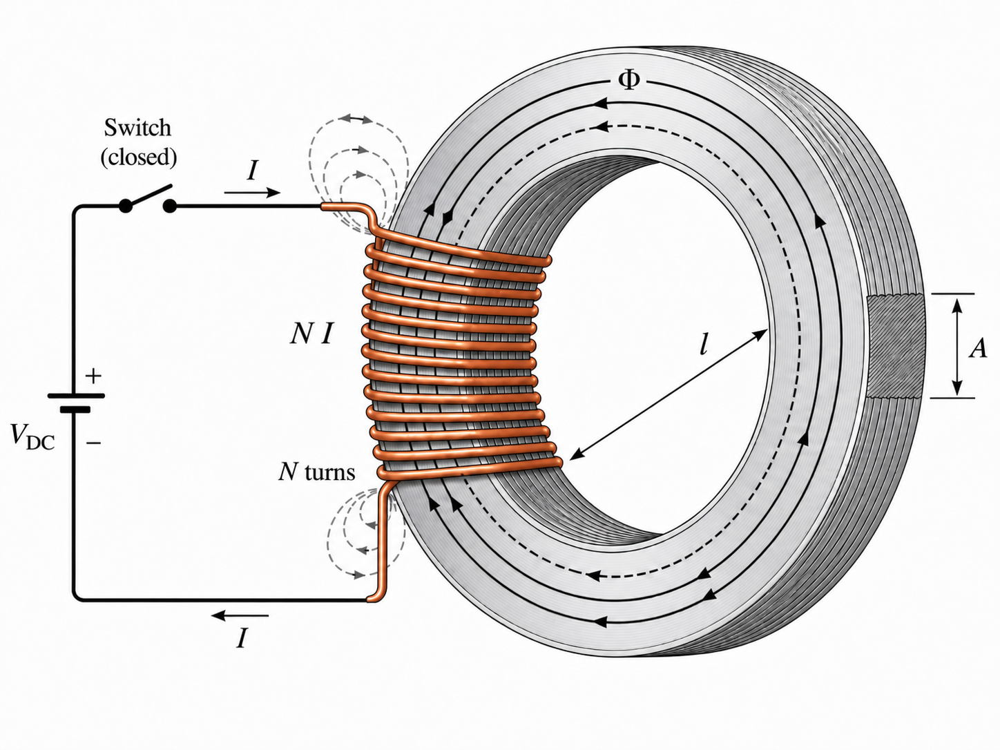
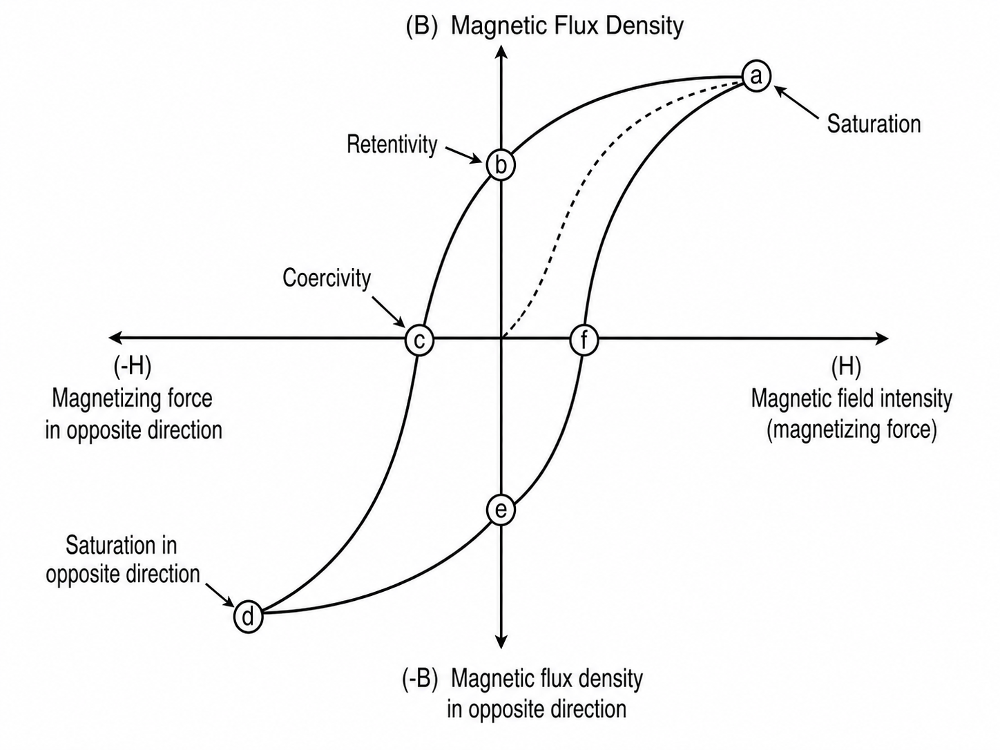
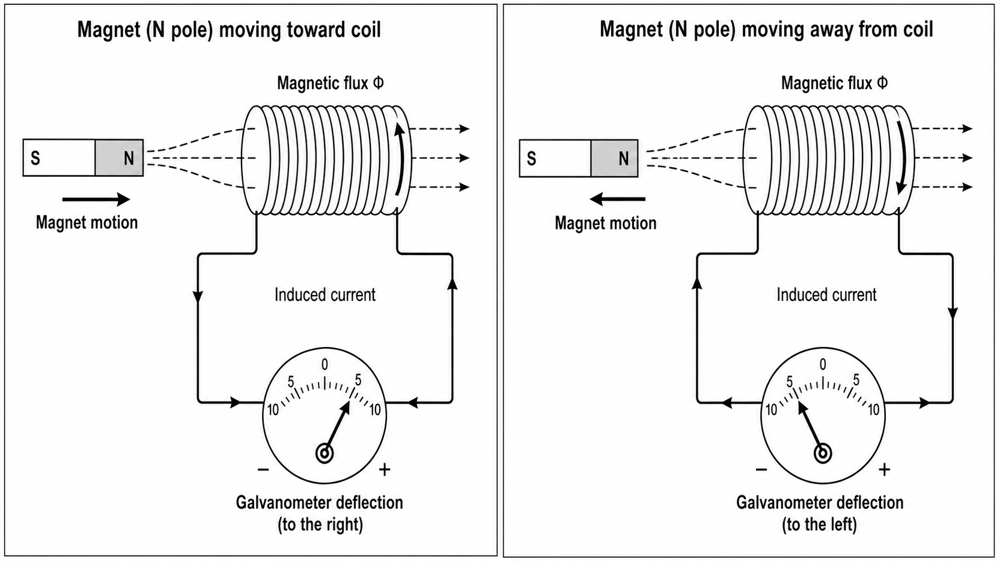
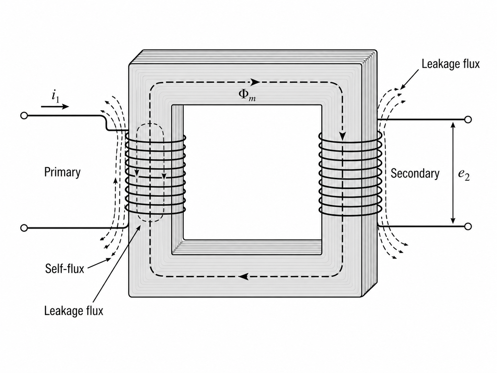
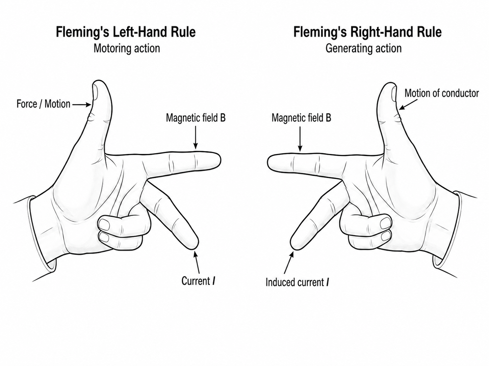

# Unit 2: Magnetic Circuits and Electromagnetic Induction

A current flowing through a coil produces a magnetic effect, and that effect is what makes relays pull, transformers transfer energy, motors rotate, and generators deliver voltage. This chapter develops the two ideas behind those devices: the magnetic circuit, with its quantities of magnetomotive force, flux, permeability, reluctance, and core loss; and electromagnetic induction, which links a changing flux to an induced emf and leads directly to self-inductance, mutual inductance, and Fleming's rules.

## 2.1 Magnetic Circuit Fundamentals

A current in a straight wire sets up a magnetic field around it. The same current in a coil wound on an iron core produces a much stronger field, because iron and steel carry magnetic flux far more easily than air. Engineers describe the preferred path of that flux through iron as a **magnetic circuit**. The name is an analogy for calculation, not a claim that flux is a flowing substance in the sense that current is a flow of charge.

<figure style="text-align: center; margin: 1.5rem auto;">
  
  <figcaption style="font-size: 0.85em; color: #555; margin-top: 0.5rem;">Figure 2.1: Toroidal magnetic circuit showing coil current, magnetomotive force, core flux path, and leakage flux.</figcaption>
</figure>

### Magnetomotive force

The cause of flux in a magnetic circuit is the **magnetomotive force** (mmf). It is not a mechanical force but the magnetic driving effect produced by a current-carrying coil. For a coil of $N$ turns carrying current $I$,

$$
\mathcal{F} = NI \tag{2.1}
$$

where $\mathcal{F}$ is in ampere-turns. The mmf scales linearly with both $N$ and $I$.

### Magnetic flux and flux density

The magnetic effect set up in the core is described by the **magnetic flux** $\Phi$, measured in webers (Wb). Flux tells how much magnetic field passes through a given cross-section. If the flux is spread over a cross-sectional area $A$, the **magnetic flux density** is

$$
B = \frac{\Phi}{A} \tag{2.2}
$$

with $B$ in tesla (T). In machine and transformer cores, flux density is the quantity to watch, because high $B$ drives the core toward saturation.

### Magnetic field intensity and permeability

The magnetizing effort per unit length of the magnetic path is the **magnetic field intensity**,

$$
H = \frac{NI}{l} \tag{2.3}
$$

in ampere-turns per metre, where $l$ is the mean length of the magnetic path. Flux density and field intensity are related by

$$
B = \mu H \tag{2.4}
$$

where $\mu$ is the **permeability** of the material, a measure of how easily the material supports flux. It is conventionally written as

$$
\mu = \mu_0 \mu_r \tag{2.5}
$$

in which $\mu_0$ is the permeability of free space and $\mu_r$ is the **relative permeability** of the material. Air has $\mu_r \approx 1$; iron and silicon steel have values orders of magnitude larger, though $\mu_r$ itself varies with the level of magnetization. This is why an iron-cored coil produces so much more flux than the same coil in air.

### Reluctance

Just as resistance opposes current in an electric circuit, **reluctance** $\mathcal{R}$ opposes flux in a magnetic circuit:

$$
\mathcal{R} = \frac{l}{\mu A} \tag{2.6}
$$

Once reluctance is known, the flux follows a circuit-like relation,

$$
\Phi = \frac{\mathcal{F}}{\mathcal{R}} \tag{2.7}
$$

often compared to Ohm's law. The analogy is useful for first calculations but must be used with care: resistance is approximately constant, whereas reluctance varies because permeability itself varies with magnetization.

**Table 2.1: Electric and magnetic circuit analogy**

| Electric circuit | Symbol | Magnetic circuit | Symbol |
|---|---:|---|---:|
| Electromotive force | $V$ | Magnetomotive force | $\mathcal{F}$ |
| Current | $I$ | Flux | $\Phi$ |
| Resistance | $R$ | Reluctance | $\mathcal{R}$ |
| Conductance | $1/R$ | Permeance | $1/\mathcal{R}$ |
| Current density | $J$ | Flux density | $B$ |

The analogy is not exact. Electric current is a real flow of charge; magnetic flux is not. A resistor dissipates power whenever current flows; a magnetic core dissipates energy mainly when flux changes, through hysteresis and eddy-current losses. And because permeability is not constant, magnetic circuits are generally nonlinear.

### Series magnetic paths and air gaps

Practical magnetic circuits are rarely a single uniform path. A transformer core has corners and limbs, an electromagnet has an iron path broken by a working-face air gap, and a relay has a path through core, armature, and small gaps. For sections in series the reluctances add,

$$
\mathcal{R}_{total} = \mathcal{R}_1 + \mathcal{R}_2 + \mathcal{R}_3 + \cdots
$$

with each section found from $\mathcal{R} = l/(\mu A)$.

An **air gap** often dominates the total reluctance even when it is physically short, because $\mu_r \approx 1$ in air against $\mu_r$ of many hundreds or thousands in iron. For a given flux density $B$, a small value of $H$ is enough inside the core but a much larger $H$ is required across the gap. The current the coil must draw to establish a required flux is therefore set largely by the gap, which is why relay, electromagnet, and inductor designers treat gap length as a primary design variable: small mechanical changes in the gap produce large changes in flux and current.

### Leakage flux and leakage factor

In an ideal core all flux would stay in the intended path. Real cores allow some flux to spread into the surrounding air; this part is called **leakage flux**. If $\Phi_u$ is the useful flux and $\Phi_t$ the total flux produced, the **leakage factor** is

$$
\lambda = \frac{\Phi_t}{\Phi_u} \tag{2.8}
$$

and is always greater than 1. Leakage flux influences coupling, voltage regulation, stray fields, and unwanted heating of nearby metal parts.

::: {.worked-example title="Worked Example 2.1"}

A toroidal iron core has mean magnetic path length $l = 0.4\ \text{m}$ and cross-sectional area $A = 4\ \text{cm}^2 = 4 \times 10^{-4}\ \text{m}^2$. A coil of 500 turns carries a current of $0.4\ \text{A}$. At this operating point the core has relative permeability 800. Find the mmf, reluctance, flux, and flux density.

$$
\mathcal{F} = NI = 500 \times 0.4 = 200\ \text{A-turns}
$$

$$
\mu = \mu_0 \mu_r = 4\pi \times 10^{-7} \times 800 \approx 1.005 \times 10^{-3}\ \text{H/m}
$$

$$
\mathcal{R} = \frac{l}{\mu A} = \frac{0.4}{(1.005 \times 10^{-3})(4 \times 10^{-4})} \approx 9.95 \times 10^{5}\ \text{A-turns/Wb}
$$

$$
\Phi = \frac{\mathcal{F}}{\mathcal{R}} = \frac{200}{9.95 \times 10^{5}} \approx 2.01 \times 10^{-4}\ \text{Wb}
$$

$$
B = \frac{\Phi}{A} = \frac{2.01 \times 10^{-4}}{4 \times 10^{-4}} \approx 0.503\ \text{T}
$$

:::

::: {.worked-example title="Worked Example 2.2"}

The total flux produced in a magnetic system is $20\ \text{mWb}$; the useful flux linking the required part of the system is $18\ \text{mWb}$. Find the leakage factor.

$$
\lambda = \frac{\Phi_t}{\Phi_u} = \frac{20}{18} = 1.11
$$

The total flux exceeds the useful flux by about 11%.

:::

::: {.worked-example title="Worked Example 2.3"}

A magnetic circuit consists of an iron path and a single air gap in series. The iron path has length $0.30\ \text{m}$, cross-sectional area $5 \times 10^{-4}\ \text{m}^2$, and relative permeability 1000 at the operating point. The air gap is $1\ \text{mm}$ long with the same area. A 400-turn coil carries $0.5\ \text{A}$. Find the iron-path reluctance, the gap reluctance, the total reluctance, and the flux.

$$
\mathcal{F} = NI = 400 \times 0.5 = 200\ \text{A-turns}
$$

$$
\mu_{iron} = 4\pi \times 10^{-7} \times 1000 \approx 1.257 \times 10^{-3}\ \text{H/m}
$$

$$
\mathcal{R}_{iron} = \frac{0.30}{(1.257 \times 10^{-3})(5 \times 10^{-4})} \approx 4.77 \times 10^{5}\ \text{A-turns/Wb}
$$

$$
\mathcal{R}_{gap} = \frac{0.001}{(4\pi \times 10^{-7})(5 \times 10^{-4})} \approx 1.59 \times 10^{6}\ \text{A-turns/Wb}
$$

$$
\mathcal{R}_{total} = 4.77 \times 10^{5} + 1.59 \times 10^{6} \approx 2.07 \times 10^{6}\ \text{A-turns/Wb}
$$

$$
\Phi = \frac{\mathcal{F}}{\mathcal{R}_{total}} = \frac{200}{2.07 \times 10^{6}} \approx 9.66 \times 10^{-5}\ \text{Wb}
$$

The 1 mm gap contributes more than three times the reluctance of the 0.30 m iron path.

:::

### The B-H curve and saturation

If the current in a magnetizing coil is increased gradually, $H$ rises linearly with current but $B$ does not rise in fixed proportion. A plot of $B$ against $H$ — the **B-H curve** — rises steeply at first, then bends, and finally flattens as the material approaches **saturation**. In saturation, most magnetic domains are already aligned with the applied field, so further increases in $H$ produce only small increases in $B$. A transformer or inductor core driven far into saturation draws sharply rising current and heats rapidly.

The first rise of $B$ from an unmagnetized state is the **initial magnetization curve**. Along it, domains progressively align with the applied field, which is why a ferromagnetic core delivers much higher flux density than air for the same mmf. Materials differ sharply in how they follow this curve:

- **Soft magnetic materials** (silicon steel, soft iron) magnetize easily and have narrow hysteresis loops, suiting them to transformers, inductors, relays, and machines.
- **Hard magnetic materials** retain magnetism strongly and have wide loops, suiting them to permanent magnets.
- **Ferrites** combine magnetic behaviour with high electrical resistivity, reducing eddy-current loss at higher frequencies.

<figure style="text-align: center; margin: 1.5rem auto;">
  
  <figcaption style="font-size: 0.85em; color: #555; margin-top: 0.5rem;">Figure 2.2: B-H curve and hysteresis loop showing saturation, retentivity, and coercivity.</figcaption>
</figure>

### Hysteresis loop

When a ferromagnetic sample is magnetized first in one direction and then reversed, $B$ does not retrace the initial curve. Instead the $(B,H)$ trajectory forms a closed **hysteresis loop**; the term means that $B$ lags $H$. Two quantities are read directly from the loop:

- **Retentivity** (residual flux density): the value of $B$ remaining when $H$ is reduced to zero.
- **Coercivity** (coercive force): the reverse value of $H$ required to drive $B$ back to zero.

Soft materials used in transformer cores show narrow loops; hard materials used in permanent magnets show wide ones.

### Core losses

The area enclosed by the hysteresis loop equals the energy dissipated per cycle per unit volume of core material. This energy appears as heat, and because the loss is per cycle, the **hysteresis loss** rises with frequency. Choice of a soft magnetic material such as silicon steel keeps the loop narrow and the loss small at power frequencies.

A changing flux also induces circulating currents inside the conducting core itself. These **eddy currents** dissipate $I^2R$ heat in the core. Eddy-current loss is controlled by:

- building the core from thin insulated laminations rather than one solid block, which interrupts the eddy-current paths;
- using high-resistivity magnetic materials; and
- using ferrites at higher frequencies, where laminated steel becomes ineffective.

Hysteresis loss depends on repeated magnetization of the material; eddy-current loss depends on induced currents in the conducting core. Both appear together in AC magnetic equipment and both grow with frequency, which is why transformer cores, motor stators, and machine parts are laminated rather than solid.

## 2.2 Electromagnetic Induction

Place a coil near a stationary magnet and nothing appears at the terminals. Move the magnet toward the coil and a voltage appears; pull it away and the voltage reverses; hold the magnet still again and the voltage vanishes. This is the central fact of **electromagnetic induction**: an emf is induced in a conductor or coil whenever the magnetic flux linking it changes. Generators, transformers, ignition coils, inductive sensors, chokes, and most switched-mode power converters depend on it.

<figure style="text-align: center; margin: 1.5rem auto;">
  
  <figcaption style="font-size: 0.85em; color: #555; margin-top: 0.5rem;">Figure 2.3: Induced current and galvanometer deflection when a bar magnet approaches and recedes from a coil.</figcaption>
</figure>

### Faraday's laws

Faraday's experimental results are summarized in two statements:

1. Whenever the magnetic flux linking a circuit changes, an emf is induced in the circuit.
2. The magnitude of the induced emf is proportional to the rate of change of flux linkage.

For a coil of $N$ turns in which each turn links flux $\Phi$, the flux linkage is $N\Phi$ and the induced emf is

$$
\boxed{\,e = -N\frac{d\Phi}{dt}\,} \tag{2.9}
$$

where $e$ is in volts. For many elementary problems the average induced emf is sufficient:

$$
E_{avg} = \frac{N\,\Delta\Phi}{\Delta t} \tag{2.10}
$$

Equation (2.10) gives magnitude; direction is fixed by Lenz's law.

### Lenz's law

The negative sign in Equation (2.9) is explained by **Lenz's law**: the induced emf acts in a direction that opposes the change producing it. When the north pole of a magnet approaches a coil, the induced current establishes a flux that opposes the increase, so the coil appears to resist the magnet's approach. When the magnet is withdrawn, the induced current reverses and tries to sustain the decaying flux. Lenz's law is a consequence of energy conservation: if the induced current supported rather than opposed the change, energy would appear without input work.

### Dynamically induced emf

If a conductor physically moves through a magnetic field and cuts flux, the resulting emf is called **dynamically induced**. Consider a straight conductor of active length $l$ moving with speed $v$ perpendicular to a field of flux density $B$. In time $\Delta t$ it sweeps an area $\Delta A = lv\,\Delta t$, cutting flux $\Delta\Phi = Blv\,\Delta t$. By Equation (2.10),

$$
\boxed{\,E = Blv\,} \tag{2.11}
$$

with $B$ in tesla, $l$ in metres, and $v$ in metres per second. This is the basic emf relation behind every generator.

::: {.worked-example title="Worked Example 2.4"}

A straight conductor of length $0.25\ \text{m}$ moves at $8\ \text{m/s}$ at right angles to a field of flux density $0.6\ \text{T}$. Find the induced emf.

$$
E = Blv = 0.6 \times 0.25 \times 8 = 1.2\ \text{V}
$$

:::

### Statically induced emf

When a conductor does not move but the flux linking it changes in time, the resulting emf is **statically induced**. This occurs in a stationary coil when its own current, or the current in a nearby coil, changes. Two forms arise:

- **self-induced emf**, due to a coil's own changing current;
- **mutually induced emf**, due to a changing current in a neighbouring coil.

### Self-inductance

When the current through a coil changes, the flux it produces changes, and that changing flux induces an emf in the same coil. This is **self-inductance**:

$$
e = -L\frac{di}{dt} \tag{2.12}
$$

where $L$ is the self-inductance in henries (H). One henry corresponds to an induced emf of 1 V for a rate of current change of $1\ \text{A/s}$. By Lenz's law the sign is opposing: rising current induces an emf that retards it, and falling current induces an emf that tries to sustain it. This is why an inductor current cannot change instantaneously, and why breaking the current in a relay coil or motor winding produces a high-voltage spike across the contacts — an effect commonly suppressed by a freewheeling diode.

::: {.worked-example title="Worked Example 2.5"}

A coil of inductance $2\ \text{H}$ carries a current that increases uniformly from $0\ \text{A}$ to $3\ \text{A}$ in $0.05\ \text{s}$. Find the magnitude of the induced emf.

$$
|e| = L\frac{\Delta i}{\Delta t} = 2 \times \frac{3}{0.05} = 120\ \text{V}
$$

The emf acts against the rise in current.

:::

### Mutual inductance

When two coils lie close enough that some of the flux produced by the first links the second, a change in the first coil's current induces an emf in the second. This is **mutual inductance**:

$$
e_2 = -M\frac{di_1}{dt} \tag{2.13}
$$

where $M$ is the mutual inductance between the two coils. This is the principle of the transformer: changing current in the primary sets up a changing flux in the common core, which links the secondary and induces an emf there. No charge crosses from one winding to the other; energy transfers through the magnetic field alone, which is why transformer windings remain electrically isolated.

### Flux linkage and coefficient of coupling

If a coil has $N$ turns and each turn links the same flux $\Phi$, the flux linkage is $N\Phi$. Inductance measures how strongly a change in current changes this flux linkage.

For two coils, not all the flux produced by one necessarily links the other. Some escapes as leakage flux, so the coupling between coils is rarely perfect. The closeness of coupling is described by the **coefficient of coupling**,

$$
k = \frac{M}{\sqrt{L_1 L_2}}
$$

where $L_1$ and $L_2$ are the self-inductances and $0 \le k \le 1$. A value near 1 indicates tight coupling; a small value indicates loose coupling. Even in transformer windings on a common core, $k$ is slightly less than 1, which is why real transformers exhibit leakage reactance and voltage regulation.

<figure style="text-align: center; margin: 1.5rem auto;">
  
  <figcaption style="font-size: 0.85em; color: #555; margin-top: 0.5rem;">Figure 2.4: Mutual induction in two coils on a common core, showing mutual flux, self-flux, leakage flux, and induced secondary emf.</figcaption>
</figure>

::: {.worked-example title="Worked Example 2.6"}

Two coils have mutual inductance $0.4\ \text{H}$. The current in the first coil decreases uniformly from $5\ \text{A}$ to $1\ \text{A}$ in $0.02\ \text{s}$. Find the magnitude of the induced emf in the second coil.

$$
|e_2| = M\frac{|\Delta i_1|}{\Delta t} = 0.4 \times \frac{4}{0.02} = 80\ \text{V}
$$

:::

## 2.3 Direction Rules

The direction of an induced emf, or of the force on a current-carrying conductor, is set by the mutual orientation of field, current, and motion. Two hand rules due to Fleming fix this direction at a glance: one for motor action, the other for generator action.

<figure style="text-align: center; margin: 1.5rem auto;">
  
  <figcaption style="font-size: 0.85em; color: #555; margin-top: 0.5rem;">Figure 2.5: Fleming's left-hand rule for motoring action and right-hand rule for generating action.</figcaption>
</figure>

### Fleming's Left-Hand Rule

**Fleming's Left-Hand Rule** gives the direction of force on a current-carrying conductor in a magnetic field. Hold the thumb, forefinger, and middle finger of the left hand mutually perpendicular; then

- the **forefinger** points along the magnetic field,
- the **middle finger** points along the current, and
- the **thumb** points along the force or resulting motion.

This is the rule behind electric motors, moving-coil instruments, and loudspeakers.

::: {.worked-example title="Worked Example 2.7"}

A straight conductor carries current upward between the pole faces of a magnet, with the magnetic field directed from left to right in the viewer's frame. Find the direction of force on the conductor.

Applying Fleming's Left-Hand Rule with forefinger left-to-right and middle finger upward, the thumb points **out of the page, toward the observer**. The force is perpendicular to both the field and the current.

:::

### Fleming's Right-Hand Rule

**Fleming's Right-Hand Rule** gives the direction of induced current in a conductor moving through a magnetic field. Hold the thumb, forefinger, and middle finger of the right hand mutually perpendicular; then

- the **thumb** points along the motion of the conductor,
- the **forefinger** points along the magnetic field, and
- the **middle finger** points along the induced current.

This is the rule used for generators and for simple moving-conductor emf problems.

::: {.worked-example title="Worked Example 2.8"}

A conductor moves downward through a magnetic field directed from left to right in the viewer's frame. Find the direction of induced current.

Applying Fleming's Right-Hand Rule with thumb downward and forefinger left-to-right, the middle finger points **into the page**. The induced current in the conductor flows away from the observer.

:::

**Table 2.2: Which direction rule to use**

| Situation | Physical effect | Rule to use |
|---|---|---|
| Current-carrying conductor in a magnetic field | Force or motion produced | Fleming's Left-Hand Rule |
| Conductor moving through a magnetic field | Induced emf or current produced | Fleming's Right-Hand Rule |

Both rules give direction only; magnitudes come from $F = BIl$ or $E = Blv$. Conventional current direction is used throughout unless a problem states otherwise.

## Worked Interpretation Exercise

### Reading an Inductor Datasheet

Real components expose the ideas of this chapter in concise numerical form. Consider the specification table for the TDK PLEC69B thin-film power inductor, and in particular the part `PLEC69BCA100M-1PT00`:

- nominal inductance = $10\ \mu\text{H}$
- inductance tolerance = $\pm 20\%$
- inductance measuring frequency = $1\ \text{MHz}$
- maximum DC resistance = $1680\ \text{m}\Omega = 1.68\ \Omega$
- saturation-based current limit, $I_{sat} = 0.2\ \text{A}$
- temperature-rise-based current limit, $I_{temp} = 0.35\ \text{A}$
- operating temperature range = $-40\,^\circ\text{C}$ to $+125\,^\circ\text{C}$ including self-heating.

The datasheet defines the rated current as the smaller of $I_{sat}$ and $I_{temp}$, so for this part

$$
I_{rated} = 0.2\ \text{A}
$$

The saturation limit, not the heating limit, sets the usable current: the core's inductance begins to collapse before the winding overheats. A $\pm 20\%$ tolerance on a $10\ \mu\text{H}$ nominal value allows a measured inductance between $8\ \mu\text{H}$ and $12\ \mu\text{H}$ at the specified test frequency. The DC resistance sets the copper loss; at $0.1\ \text{A}$,

$$
P = I^2 R = (0.1)^2 \times 1.68 = 16.8\ \text{mW}
$$

Small in absolute terms, but significant for a component this size. Each datasheet entry maps directly onto a chapter concept: inductance onto self-inductance, $I_{sat}$ onto core saturation, DC resistance onto winding loss, and the temperature range onto safe operation.

## Further Reading

1. A. E. Fitzgerald, Charles Kingsley Jr., and Stephen D. Umans, *Electric Machinery* — classic text for magnetic circuits, transformers, and electromechanical energy conversion.

2. Stephen J. Chapman, *Electric Machinery Fundamentals* — widely used machine text with accessible treatment of magnetic circuits, induction, transformers, and motors.

3. I. J. Nagrath and D. P. Kothari, *Electric Machines* — popular text for magnetic circuits, electromagnetic induction, transformers, and rotating machines.

4. Edward Hughes, John Hiley, Keith Brown, and Ian McKenzie Smith, *Electrical and Electronic Technology* — broad introductory reference connecting magnetic effects with practical electrical equipment.
