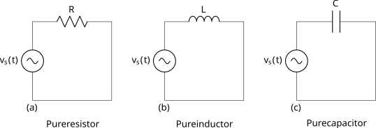
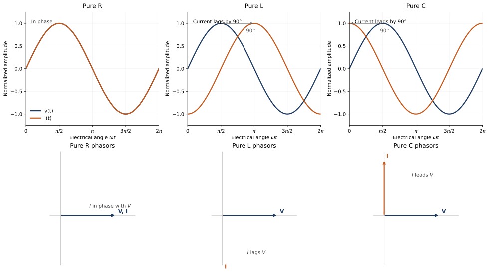

# Unit 3: A.C. Circuits

## Chapter Opening

Most electrical systems around us do not operate on steady DC. The supply reaching homes, classrooms, workshops, and small industries is alternating current, and even equipment that runs internally on DC — battery chargers, computer power supplies, LED drivers — usually takes AC at its input. AC circuit theory is therefore central to electrical engineering.

This chapter develops the language and methods used for sinusoidal AC. It begins with waveform terminology and the RMS, average, form-factor, and peak-factor relations. It then examines the three basic circuit elements under sinusoidal excitation, combines them in series and parallel, and develops the phasor and complex-impedance methods needed for practical analysis. The chapter closes with AC power quantities and the voltage-current relations of balanced three-phase star and delta loads. It draws on Chapter 1 (passive components) and Chapter 2 (self-inductance) and prepares the ground for transformers, machines, measurements, and power systems.

## Core Content

### 3.1 Basic AC Terms

A torch powered by a battery carries current in a fixed direction; the 230 V, 50 Hz voltage at a wall outlet does not. It rises, falls to zero, reverses, reaches a negative peak, and returns again, repeating this pattern many times each second. This periodic reversal gives alternating current its name.

At this level we study the **sinusoidal waveform** because it is the waveform produced naturally by alternators and because AC relations take simple, compact forms for a sine wave [OpenStax, *University Physics Volume 2, 15.2 Simple AC Circuits*](https://openstax.org/books/university-physics-volume-2/pages/15-2-simple-ac-circuits).

#### Instantaneous value and amplitude

The value of an AC quantity at a particular instant is its **instantaneous value**, written $v(t)$ or $i(t)$. For a sinusoidal voltage and current,

$$
v(t) = V_m \sin \omega t \tag{3.1}
$$

$$
i(t) = I_m \sin \omega t \tag{3.2}
$$

Here $V_m$ and $I_m$ are the **peak values** or **amplitudes**, measured from the zero axis, and $\omega$ is the angular speed in radians per second.

#### Cycle, time period, and frequency

A **cycle** is one complete repetition of the waveform. The **time period** $T$, in seconds, is the time taken for one cycle. The **frequency** $f$, in hertz, is the number of cycles per second:

$$
f = \frac{1}{T} \tag{3.3}
$$

A 50 Hz supply completes 50 cycles per second.

#### Angular speed

One sinusoidal cycle corresponds to $2\pi$ radians, so the **angular speed** or **angular frequency** is

$$
\omega = 2\pi f \tag{3.4}
$$

For 50 Hz, $\omega = 2\pi \times 50 \approx 314\ \text{rad/s}$, a value that appears throughout power-frequency calculations.

#### Worked Example 3.1

An AC waveform has frequency $50\ \text{Hz}$. Find the time period and the angular speed.

$$
T = \frac{1}{f} = \frac{1}{50} = 0.02\ \text{s} = 20\ \text{ms}
$$

$$
\omega = 2\pi f = 2\pi \times 50 \approx 314\ \text{rad/s}
$$

#### RMS value

Because the instantaneous value of a sine wave varies continuously, comparison with DC — especially in terms of heating — requires a single equivalent figure. The **root mean square** or **RMS value** of an AC quantity is the DC value that would produce the same heating effect in a resistor [Fluke, *What is true-RMS?*](https://www.fluke.com/en-gb/learn/blog/electrical/what-is-true-rms). For a sinusoidal voltage and current,

$$
V_{rms} = \frac{V_m}{\sqrt{2}}, \qquad I_{rms} = \frac{I_m}{\sqrt{2}} \tag{3.5}
$$

When the mains supply is called "230 V," that value is the RMS. The corresponding peak is $V_m = \sqrt{2}\,V_{rms} \approx 325\ \text{V}$.

#### Average value

The average of a symmetrical sine wave over a full cycle is zero, since the positive and negative halves cancel. The practical figure of interest is therefore the **half-cycle average**:

$$
V_{avg} = \frac{2V_m}{\pi} \approx 0.637\,V_m, \qquad I_{avg} = \frac{2I_m}{\pi} \approx 0.637\,I_m \tag{3.6}
$$

#### Form factor and peak factor

Two ratios characterise waveform shape:

$$
\text{Form factor} = \frac{V_{rms}}{V_{avg}}, \qquad \text{Peak factor} = \frac{V_m}{V_{rms}} \tag{3.7}
$$

For a sine wave, the form factor is $0.707/0.637 \approx 1.11$ and the peak factor is $1/0.707 \approx 1.414$. Both figures are used in instrument interpretation, where a meter calibrated for a sine wave can be in error for non-sinusoidal inputs [Fluke, *What is true-RMS?*](https://www.fluke.com/en-gb/learn/blog/electrical/what-is-true-rms).

#### Worked Example 3.2

The RMS value of an AC supply is $230\ \text{V}$. Find the peak value, half-cycle average, form factor, and peak factor.

$$
V_m = \sqrt{2}\,V_{rms} \approx 325.2\ \text{V}
$$

$$
V_{avg} = \frac{2V_m}{\pi} \approx 207.0\ \text{V}
$$

$$
\text{Form factor} = \frac{230}{207.0} \approx 1.11, \qquad \text{Peak factor} = \frac{325.2}{230} \approx 1.414
$$

#### Phase and phase difference

Two sine waves of the same frequency may not reach their peaks at the same instant. The relative angular position of a sinusoidal quantity is its **phase**, and the angular separation between two same-frequency waveforms is their **phase difference**. If they rise and fall together they are **in phase**; if one peaks later it **lags**; if one peaks earlier it **leads**. A current that peaks one-quarter cycle after its voltage lags by $90^\circ$.

#### Phasors and complex-number representation

Drawing full sine waves every time two AC quantities are compared is cumbersome. Engineers represent a sinusoid of fixed frequency by a **phasor**: a vector whose length is the amplitude (or RMS value) and whose angle is the phase. In a circuit whose voltages and currents share one frequency, equal phasor directions mean in phase, a phasor drawn ahead by $\phi$ means it leads by $\phi$, and one drawn behind means it lags [OpenStax, *University Physics Volume 2, 15.3 RLC Series Circuits with AC*](https://openstax.org/books/university-physics-volume-2/pages/15-3-rlc-series-circuits-with-ac). Phasor representation assumes a single common frequency; a diagram combining different-frequency components is not meaningful.

A phasor is represented algebraically by a complex number. In electrical engineering the imaginary unit is written $j$ (because $i$ denotes current), with

$$
j = \sqrt{-1}, \qquad j^2 = -1 \tag{3.8}
$$

A complex number in rectangular form is $z = a + jb$; its magnitude and argument are

$$
|z| = \sqrt{a^2 + b^2}, \qquad \theta = \tan^{-1}\left(\frac{b}{a}\right) \tag{3.9}
$$

The same quantity written in polar form is $z = |z|\angle\theta$. Rectangular form is convenient for addition and subtraction; polar form is convenient for multiplication, division, and reading magnitude and angle. A voltage phasor of magnitude $V$ at angle $\theta$ is written

$$
\tilde V = V\angle\theta = V(\cos\theta + j\sin\theta) \tag{3.10}
$$

and the tilde distinguishes phasor quantities from time-domain instantaneous values.

A few conversions illustrate the arithmetic:

$$
8 + j6 = 10\angle 36.9^\circ, \qquad 12 - j5 = 13\angle(-22.6^\circ)
$$

$$
20\angle 30^\circ = 17.32 + j10, \qquad 15\angle(-53.1^\circ) = 9 - j12
$$

When converting from rectangular to polar, the quadrant of the point must be checked before accepting the value returned by $\tan^{-1}$.

#### Phase difference on an oscilloscope

On a CRO or DSO, two same-frequency sinusoids can be displayed on separate channels. Measuring the time shift $\Delta t$ between corresponding points (such as positive-going zero crossings) and the time period $T$ gives

$$
\phi = \frac{\Delta t}{T}\times 360^\circ \tag{3.11}
$$

A quarter-cycle shift corresponds to $90^\circ$. Modern digital scopes report phase directly in degrees, but the relation above remains the basis for interpreting the measurement [Tektronix, *Oscilloscope Basics*](https://www.tek.com/learning/oscilloscopes-a-look-inside).

#### Impedance

In a DC circuit, opposition to current is simply the resistance. In AC, resistors oppose current by resistance, inductors oppose changes in current by **inductive reactance**, and capacitors oppose changes in voltage by **capacitive reactance**. The total opposition to AC is the **impedance** $Z$, measured in ohms. For the three ideal elements,

$$
Z_R = R \tag{3.12}
$$

$$
X_L = \omega L = 2\pi fL, \qquad Z_L = jX_L = j\omega L \tag{3.13}
$$

$$
X_C = \frac{1}{\omega C} = \frac{1}{2\pi fC}, \qquad Z_C = -jX_C = \frac{1}{j\omega C} \tag{3.14}
$$

These forms are the foundation of AC circuit analysis [OpenStax, *College Physics 2e, 23.11 Reactance, Inductive and Capacitive*](https://openstax.org/books/college-physics-2e/pages/23-11-reactance-inductive-and-capacitive) [UC Davis, *AC Circuits Summary*](https://122.physics.ucdavis.edu/sites/default/files/files/Electronics/AC_Circuit_Summary.pdf).

#### Table 3.1 Basic AC waveform quantities for a sine wave

| Quantity | Symbol | Relation |
| --- | ---: | --- |
| Time period | $T$ | $1/f$ |
| Angular speed | $\omega$ | $2\pi f$ |
| RMS voltage | $V_{rms}$ | $V_m/\sqrt{2}$ |
| RMS current | $I_{rms}$ | $I_m/\sqrt{2}$ |
| Half-cycle average voltage | $V_{avg}$ | $2V_m/\pi$ |
| Half-cycle average current | $I_{avg}$ | $2I_m/\pi$ |
| Form factor | — | $V_{rms}/V_{avg} \approx 1.11$ |
| Peak factor | — | $V_m/V_{rms} \approx 1.414$ |

### 3.2 Pure R, L, and C under Sinusoidal Excitation

The cleanest way to reach AC circuit behaviour is to study the three basic elements one at a time under the same sinusoidal excitation.

#### Pure resistance

Applying $v(t) = V_m \sin \omega t$ across a resistor gives, by Ohm's law,

$$
i_R(t) = \frac{V_m}{R}\sin \omega t \tag{3.15}
$$

Voltage and current share zero crossings and peaks. The phase difference is zero, and the impedance is $Z_R = R$. In RMS terms, $I_{rms} = V_{rms}/R$, so a purely resistive heater draws the same average power on AC as on DC at equal RMS voltage.

#### Pure inductance

For a sinusoidal voltage across a pure inductor,

$$
i_L(t) = \frac{V_m}{X_L}\sin(\omega t - 90^\circ), \qquad X_L = \omega L \tag{3.16}
$$

The current lags the voltage by $90^\circ$: when the applied voltage is at its positive peak, the current is crossing zero; when the voltage reaches zero, the current is at its positive peak. The physical origin, developed in Chapter 2, is the self-induced emf that opposes any change in current. In RMS form, $I_{rms} = V_{rms}/X_L$.

#### Pure capacitance

For a sinusoidal voltage across a pure capacitor,

$$
i_C(t) = \frac{V_m}{X_C}\sin(\omega t + 90^\circ), \qquad X_C = \frac{1}{\omega C} \tag{3.17}
$$

The current leads the voltage by $90^\circ$. A capacitor passes more current at higher frequency because rapid voltage changes move charge onto and off its plates more quickly. In RMS form, $I_{rms} = V_{rms}/X_C$.

Figure 3.1 shows the reference circuits and the corresponding waveform and phasor relationships.

#### Frequency dependence of reactance

Inductive and capacitive reactance vary oppositely with frequency. Because $X_L = 2\pi fL$ increases with frequency while $X_C = 1/(2\pi fC)$ decreases with it, an inductor opposes high-frequency current more strongly and a capacitor opposes low-frequency current more strongly. This contrast underlies filters, tuning, and many power-electronic circuits.

#### Worked Example 3.3

Find the inductive reactance of a $0.2\ \text{H}$ coil at $50\ \text{Hz}$.

$$
X_L = 2\pi fL = 2\pi \times 50 \times 0.2 \approx 62.8\ \Omega
$$

#### Worked Example 3.4

Find the capacitive reactance of a $20\ \mu\text{F}$ capacitor at $50\ \text{Hz}$.

$$
X_C = \frac{1}{2\pi fC} = \frac{1}{2\pi \times 50 \times 20 \times 10^{-6}} \approx 159.2\ \Omega
$$

Real components are never perfectly ideal. A practical resistor shows small parasitic inductance or capacitance at high frequency; a practical inductor has winding resistance, and its inductance can fall as the magnetic core approaches saturation [Murata, *Technical Terms for Inductors*](https://www.murata.com/en-us/products/inductor/overview/learn/glossary). A practical capacitor has tolerance, leakage, a voltage rating, and frequency limits. Pure R, L, and C remain the right building blocks for beginning analysis, but equipment selection depends on the full set of component ratings.

### 3.3 Simple AC Circuits

Practical AC circuits combine resistance and reactance, so voltage and current are generally neither in phase nor $90^\circ$ apart. Two facts carry most beginner calculations:

- In a **series** circuit, the same current flows through every element.
- In a **parallel** circuit, the same voltage appears across every branch.

#### R-L series circuit

With a common current through $R$ and $L$, the resistor voltage $V_R$ is in phase with the current and the inductor voltage $V_L$ leads it by $90^\circ$. The source voltage is the phasor sum of $V_R$ and $V_L$, so it leads the current by an angle between $0^\circ$ and $90^\circ$ — the circuit is lagging. The complex impedance, its magnitude, and phase angle are

$$
Z_{RL} = R + jX_L \tag{3.18}
$$

$$
|Z_{RL}| = \sqrt{R^2 + X_L^2}, \qquad \tan \phi = \frac{X_L}{R} \tag{3.19}
$$

and the current follows from the AC form of Ohm's law,

$$
\tilde I = \frac{\tilde V}{\tilde Z} \tag{3.20}
$$

#### Worked Example 3.5

An R-L series circuit with $R = 30\ \Omega$ and $X_L = 40\ \Omega$ is connected to $230\ \text{V}$ AC. Find the impedance, current, and phase angle.

Taking magnitudes first,

$$
Z = \sqrt{30^2 + 40^2} = 50\ \Omega, \qquad I = \frac{230}{50} = 4.6\ \text{A}
$$

$$
\tan \phi = \frac{40}{30} = 1.333, \qquad \phi \approx 53.1^\circ
$$

The same result in complex form, with the supply voltage as reference, is

$$
\tilde Z = 30 + j40 = 50\angle 53.1^\circ\ \Omega
$$

$$
\tilde I = \frac{230\angle 0^\circ}{50\angle 53.1^\circ} = 4.6\angle(-53.1^\circ)\ \text{A}
$$

The negative angle confirms that the current lags the supply by $53.1^\circ$. Subsequent examples use whichever form is more direct.

#### R-C series circuit

The resistor voltage remains in phase with the current while the capacitor voltage lags the current by $90^\circ$, so the source voltage lags the current and the circuit is leading. The impedance forms are

$$
Z_{RC} = R - jX_C \tag{3.21}
$$

$$
|Z_{RC}| = \sqrt{R^2 + X_C^2}, \qquad \tan \phi = \frac{X_C}{R} \tag{3.22}
$$

#### Worked Example 3.6

An R-C series circuit with $R = 40\ \Omega$ and $X_C = 30\ \Omega$ is connected to $200\ \text{V}$ AC. Find the current phasor.

$$
\tilde Z = 40 - j30 = 50\angle(-36.9^\circ)\ \Omega
$$

$$
\tilde I = \frac{200\angle 0^\circ}{50\angle(-36.9^\circ)} = 4\angle 36.9^\circ\ \text{A} = 3.2 + j2.4\ \text{A}
$$

The current leads the supply voltage by $36.9^\circ$.

#### R-L-C series circuit

When a resistor, inductor, and capacitor are in series, the inductive and capacitive reactances act oppositely, giving a net reactance $X = X_L - X_C$. The impedance and phase angle are therefore

$$
Z_{RLC} = R + j(X_L - X_C) \tag{3.23}
$$

$$
|Z_{RLC}| = \sqrt{R^2 + (X_L - X_C)^2}, \qquad \tan \phi = \frac{X_L - X_C}{R} \tag{3.24}
$$

If $X_L > X_C$ the circuit is net inductive and the current lags; if $X_C > X_L$ the circuit is net capacitive and the current leads; if $X_L = X_C$ the impedance is purely resistive at that frequency and the current is in phase with the voltage. A detailed treatment of the last case (resonance) is left to a later course.

Figure 3.2 shows waveform and phasor interpretations for the three series circuits, including the three phase outcomes of the R-L-C case.

Because the same current flows through every element in a series circuit,

$$
V_R = IR, \qquad V_L = IX_L, \qquad V_C = IX_C \tag{3.25}
$$

The supply voltage, however, is not the arithmetic sum $V_R + V_L + V_C$; the voltages are not in phase and must be combined phasorially. For a series R-L-C circuit,

$$
V = \sqrt{V_R^2 + (V_L - V_C)^2} \tag{3.26}
$$

In reactive circuits, $V_L$ or $V_C$ can individually exceed the supply voltage.

#### Worked Example 3.7

An R-L-C series circuit with $R = 20\ \Omega$, $X_L = 50\ \Omega$, $X_C = 30\ \Omega$ is connected to $230\ \text{V}$, $50\ \text{Hz}$. Find the current, phase angle, and voltage across each element.

Net reactance and impedance:

$$
X = X_L - X_C = 20\ \Omega, \qquad Z = \sqrt{20^2 + 20^2} \approx 28.3\ \Omega
$$

Current and phase angle:

$$
I = \frac{230}{28.3} \approx 8.13\ \text{A}, \qquad \tan\phi = 1, \qquad \phi = 45^\circ \text{ (lagging)}
$$

Element voltages:

$$
V_R = 8.13 \times 20 \approx 162.6\ \text{V}
$$

$$
V_L = 8.13 \times 50 \approx 406.5\ \text{V}, \qquad V_C = 8.13 \times 30 \approx 243.9\ \text{V}
$$

Although $V_L$ and $V_C$ individually exceed the supply, the phasor combination is consistent:

$$
V = \sqrt{162.6^2 + (406.5 - 243.9)^2} \approx 230\ \text{V}
$$

#### Parallel circuits and admittance

In a parallel AC circuit the supply voltage is common to every branch while the branch currents generally differ in magnitude and phase. For the three basic branches fed from a voltage $V$,

$$
I_R = \frac{V}{R}, \qquad I_L = \frac{V}{X_L}, \qquad I_C = \frac{V}{X_C} \tag{3.27}
$$

with $I_R$ in phase with $V$, $I_L$ lagging by $90^\circ$, and $I_C$ leading by $90^\circ$. The total line current is the phasor sum. The treatment is therefore the mirror image of the series case: in series circuits, current is common and voltages are added phasorially; in parallel circuits, voltage is common and currents are added phasorially.

The reciprocal of impedance is the **admittance**:

$$
Y = \frac{1}{Z} = G + jB \tag{3.28}
$$

where $G$ is the **conductance** and $B$ is the **susceptance**, both in siemens [UC Davis, *AC Circuits Summary*](https://122.physics.ucdavis.edu/sites/default/files/files/Electronics/AC_Circuit_Summary.pdf). For the three pure elements,

$$
Y_R = \frac{1}{R}, \qquad Y_L = -\frac{j}{X_L}, \qquad Y_C = \frac{j}{X_C} \tag{3.29}
$$

The sign pattern reflects the phase relations: in an inductive branch the current lags the voltage, so the imaginary part of $Y$ is negative; in a capacitive branch the current leads, so the imaginary part is positive. Impedances add directly in series; admittances add directly in parallel. For a parallel R-L-C circuit the total admittance is therefore

$$
Y_{RLC} = \frac{1}{R} + j\left(\frac{1}{X_C} - \frac{1}{X_L}\right) \tag{3.30}
$$

with magnitude $|Y| = \sqrt{G^2 + B^2}$, supply current $\tilde I = \tilde V\tilde Y$, and total impedance $Z = 1/Y$. The magnitude of the line current can also be written

$$
I = \sqrt{I_R^2 + (I_L - I_C)^2} \tag{3.31}
$$

For an introductory reading, the branch-current method — find each branch current, then combine phasorially — is often easier. The admittance method is more compact when the number of branches grows.

#### Worked Example 3.8

A parallel R-L-C circuit with $R = 100\ \Omega$, $L = 0.2\ \text{H}$, $C = 20\ \mu\text{F}$ is connected to $230\ \text{V}$, $50\ \text{Hz}$. Find the branch currents, the total current, and the total impedance.

Reactances:

$$
X_L = 2\pi \times 50 \times 0.2 \approx 62.8\ \Omega, \qquad X_C \approx 159.2\ \Omega
$$

Branch currents:

$$
I_R = \frac{230}{100} = 2.3\ \text{A}, \qquad I_L = \frac{230}{62.8} \approx 3.66\ \text{A}, \qquad I_C = \frac{230}{159.2} \approx 1.44\ \text{A}
$$

In phasor form, with the supply voltage as reference,

$$
\tilde I = 2.3 - j3.66 + j1.44 = 2.3 - j2.22\ \text{A}
$$

$$
|\tilde I| \approx 3.20\ \text{A}, \qquad \phi \approx -44.0^\circ
$$

so $\tilde I \approx 3.20\angle(-44.0^\circ)\ \text{A}$. The inductive current dominates and the circuit is net inductive. The total admittance and impedance follow directly:

$$
\tilde Y = \frac{\tilde I}{\tilde V} \approx 0.0139\angle(-44.0^\circ)\ \text{S}, \qquad \tilde Z = \frac{1}{\tilde Y} \approx 71.9\angle 44.0^\circ\ \Omega
$$

#### Problem-solving method

For a consistent approach to mixed AC circuits:

1. List $R$, $L$, $C$, frequency, and supply voltage. Compute $X_L$ and $X_C$ if needed.
2. For a series circuit, form the total impedance and divide the supply voltage by it; then find element voltages from the common current. For a parallel circuit, compute each branch current from the common voltage, combine them phasorially, and obtain total impedance from $Z = V/I$ or $Z = 1/Y$.
3. Identify the circuit as lagging, leading, or in phase from the sign of the net reactance or net susceptance.
4. Compute power factor or power quantities if the problem calls for them.

Careful distinction between the common quantity (current in series, voltage in parallel) and the phasor-added quantity (voltage in series, current in parallel) removes most routine errors.

#### Table 3.2 Quick comparison of common AC circuits

| Circuit | Impedance | Current relation | Nature |
| --- | --- | --- | --- |
| Pure $R$ | $Z = R$ | $I$ in phase with $V$ | purely resistive |
| Pure $L$ | $Z = X_L$ | $I$ lags $V$ by $90^\circ$ | inductive |
| Pure $C$ | $Z = X_C$ | $I$ leads $V$ by $90^\circ$ | capacitive |
| Series $RL$ | $\sqrt{R^2 + X_L^2}$ | current lags | lagging |
| Series $RC$ | $\sqrt{R^2 + X_C^2}$ | current leads | leading |
| Series $RLC$ | $\sqrt{R^2 + (X_L - X_C)^2}$ | depends on $X_L$ vs $X_C$ | mixed |
| Parallel $RL$ | use admittance | total current lags | lagging |
| Parallel $RC$ | use admittance | total current leads | leading |
| Parallel $RLC$ | use admittance | depends on $I_L$ vs $I_C$ | mixed |

### 3.4 AC Power

Power in an AC circuit needs more care than in a DC circuit. In DC, $P = VI$ gives the power directly. In AC, voltage and current are generally not in phase, so not all of the product $VI$ represents useful conversion into heat, light, or mechanical work.

#### Instantaneous power in R, L, and C

The product $p(t) = v(t)i(t)$ is the **instantaneous power**. In a pure resistor, voltage and current are in phase, so $p(t)$ is always non-negative; the resistor continuously absorbs energy and dissipates it as heat. In a pure inductor, current lags voltage by $90^\circ$ and $p(t)$ alternates equally between positive and negative values: during the positive intervals, energy is stored in the magnetic field; during the negative intervals, the stored energy is returned to the source. A pure capacitor behaves analogously, storing and returning energy through the electric field [OpenStax, *University Physics Volume 2, 15.4 Power in an AC Circuit*](https://openstax.org/books/university-physics-volume-2/pages/15-4-power-in-an-ac-circuit). Over a full cycle, the average power in an ideal inductor or capacitor is zero, while the average power in a resistor is not.

#### Active, reactive, and apparent power

The three standard power quantities are

$$
\boxed{P = V_{rms}I_{rms}\cos\phi} \tag{3.32}
$$

$$
\boxed{Q = V_{rms}I_{rms}\sin\phi} \tag{3.33}
$$

$$
\boxed{S = V_{rms}I_{rms}} \tag{3.34}
$$

$P$ is the **active** (or true) power in watts, representing useful conversion. $Q$ is the **reactive power** in volt-ampere reactive (var), representing energy exchanged with reactive elements. $S$ is the **apparent power** in volt-ampere (VA). They are related by

$$
S^2 = P^2 + Q^2 \tag{3.35}
$$

For a pure resistor, $\phi = 0$, so $P = S$ and $Q = 0$. For a pure inductor or capacitor, $\phi = \pm 90^\circ$ and the average active power is zero.

#### Power factor, impedance triangle, and power triangle

The ratio of active to apparent power is the **power factor**:

$$
\cos\phi = \frac{P}{S} \tag{3.36}
$$

In a series AC circuit it also equals $R/Z$. A lagging current gives a lagging power factor, a leading current a leading power factor. Low power factor is costly because it forces a larger line current for the same useful power, increasing conductor losses and voltage drop.

Two right triangles summarise the geometry. The **impedance triangle** has $R$ as its base, net reactance $(X_L - X_C)$ as its perpendicular, and $Z$ as its hypotenuse, with angle $\phi$ at the base. The **power triangle** has $P$ as its base, $Q$ as its perpendicular, and $S$ as its hypotenuse, with the same angle $\phi$. Accordingly,

$$
\cos\phi = \frac{P}{S}, \qquad \sin\phi = \frac{Q}{S}, \qquad \tan\phi = \frac{Q}{P} \tag{3.37}
$$

Figure 3.3 shows both triangles side by side.

#### Worked Example 3.9

A single-phase load draws $8\ \text{A}$ at $230\ \text{V}$ with a lagging power factor of $0.8$. Find the apparent, active, and reactive powers.

$$
S = 230 \times 8 = 1840\ \text{VA}
$$

$$
P = 1840 \times 0.8 = 1472\ \text{W}
$$

With $\sin\phi = \sqrt{1 - 0.8^2} = 0.6$,

$$
Q = 1840 \times 0.6 = 1104\ \text{var}
$$

Many workshop and industrial loads, especially motors and transformers with inductive windings, operate at a lagging power factor. Power-factor correction — typically by shunt capacitors — is consequently a standard topic in electrical installations.

### 3.5 Three-Phase Connection Basics

Industrial systems use **three-phase AC** because it is efficient for power transmission, distribution, and motor operation. In a balanced three-phase system, three sinusoidal phase voltages of equal magnitude and common frequency are displaced by $120^\circ$ from each other. At this level the focus is the voltage-current relations for star and delta connections; generation details belong to later courses.

Figure 3.4 shows balanced star and delta loads side by side.

#### Star connection

In a **star** (or wye) connection, one end of each phase winding meets at a common neutral point, and the other ends go to the three line conductors. For a balanced star-connected load,

$$
V_L = \sqrt{3}\,V_{ph}, \qquad I_L = I_{ph} \tag{3.38}
$$

[UHI, *Balanced Star and Delta Connected Loads*](https://showcase.uhi.ac.uk/previews/ESIF_Eng/assets/resources/ThreePhaseSystems/resources/Three%20Phase%202%20of%204/build/index.html). A $400\ \text{V}$ line-to-line system therefore has a phase voltage of $400/\sqrt{3} \approx 231\ \text{V}$, which matches the $230\ \text{V}$ class of single-phase loads.

#### Delta connection

In a **delta** connection, the three phases form a closed loop and the line conductors are tapped from the three vertices. For a balanced delta-connected load,

$$
V_L = V_{ph}, \qquad I_L = \sqrt{3}\,I_{ph} \tag{3.39}
$$

So in star the voltage scales by $\sqrt{3}$ between line and phase while the current does not; in delta the current scales by $\sqrt{3}$ while the voltage does not.

#### Worked Example 3.10

A balanced star-connected load is fed at $400\ \text{V}$ line voltage with a $10\ \text{A}$ line current. Find the phase voltage and phase current.

$$
V_{ph} = \frac{400}{\sqrt{3}} \approx 231\ \text{V}, \qquad I_{ph} = I_L = 10\ \text{A}
$$

#### Worked Example 3.11

A balanced delta-connected load is fed at $400\ \text{V}$ line voltage with a $17.32\ \text{A}$ line current. Find the phase voltage and phase current.

$$
V_{ph} = V_L = 400\ \text{V}, \qquad I_{ph} = \frac{17.32}{\sqrt{3}} = 10\ \text{A}
$$

#### Table 3.3 Star and delta relations for balanced loads

| Connection | Line vs phase voltage | Line vs phase current |
| --- | --- | --- |
| Star (Y) | $V_L = \sqrt{3}\,V_{ph}$ | $I_L = I_{ph}$ |
| Delta ($\Delta$) | $V_L = V_{ph}$ | $I_L = \sqrt{3}\,I_{ph}$ |

### 3.6 Practice Set

#### Direct formula questions

1. A sinusoidal supply has frequency $50\ \text{Hz}$. Find its time period.
2. The RMS voltage of a sine wave is $230\ \text{V}$. Find its peak value.
3. Find the inductive reactance of a $0.1\ \text{H}$ inductor at $50\ \text{Hz}$.
4. Find the capacitive reactance of a $50\ \mu\text{F}$ capacitor at $50\ \text{Hz}$.

#### Phasor and graph questions

1. In a pure inductive circuit with voltage as reference, where is the current phasor drawn?
2. In a pure capacitive circuit, how does the current waveform shift compare with the voltage wave?
3. In an R-L series circuit, why is the supply voltage not the arithmetic sum of $V_R$ and $V_L$?
4. What does the instantaneous-power waveform of a pure capacitor imply about its average power?

#### Complex-impedance questions

1. Convert $6 + j8$ to polar form.
2. Convert $20\angle 60^\circ$ to rectangular form.
3. A series circuit has $R = 25\ \Omega$ and $X_L = 15\ \Omega$. Write its impedance in rectangular and polar form.
4. A series circuit has $R = 12\ \Omega$, $X_L = 20\ \Omega$, $X_C = 8\ \Omega$. Find the total impedance and state whether the current leads or lags.

#### Admittance and parallel-circuit questions

1. A $100\ \Omega$ resistor is connected across $200\ \text{V}$ AC. Find the branch current.
2. A parallel combination of $R = 100\ \Omega$ and $X_C = 50\ \Omega$ is connected across $200\ \text{V}$ AC. Find the branch currents and state whether the total current leads or lags.
3. Write the admittance of a pure inductive branch in complex form and explain the sign of its imaginary part.
4. A parallel R-L-C circuit has $G = 0.02\ \text{S}$ and $B = -0.015\ \text{S}$. Find $|Y|$ and state whether the circuit is net inductive or net capacitive.

## Worked Interpretation Exercise

AC quantities are often read through an instrument specification. The [Fluke 115 True-RMS Digital Multimeter](https://www.fluke.com/en-us/product/electrical-testing/digital-multimeters/fluke-115) lists AC volts RMS ranges of `6.000 V`, `60.00 V`, and `600.0 V`; AC volts accuracy of `1.0% + 3` from `45 Hz to 500 Hz`; frequency measurement to `50.00 kHz`; and a `CAT III 600 V` safety rating.

The True-RMS designation means the meter reports RMS voltage directly, so a display of `230.0 V` on a wall socket is $230\ \text{V}_{rms}$, not a peak value [Fluke, *What is true-RMS?*](https://www.fluke.com/en-gb/learn/blog/electrical/what-is-true-rms). The 600 V top range accommodates both 230 V single-phase and 400 V three-phase line-to-line measurements, though safe use depends on correct leads and technique. The specified accuracy applies from 45 Hz to 500 Hz, comfortably spanning 50 Hz mains. The frequency counter extends to 50 kHz, which is useful for signal and drive-frequency work even though it is not needed at power frequency. The CAT III 600 V rating is a safety-category statement under IEC 61010, not a guarantee that any 600 V measurement is safe.

A motor-run capacitor illustrates the component side. The TDK Electronics listing for ordering code `B32333I6305J070` gives a nominal $3\ \mu\text{F}$ with $\pm 5\%$ tolerance, a $450\ \text{V AC}$ rating, an IEC 60252-1 life expectancy of $30\,000\ \text{h}$, and safety class S2 [TDK Electronics, *Motor Run Capacitors*](https://www.tdk-electronics.tdk.com/en/3192234/products/product-catalog/film-capacitors/motor-run-and-motor-start-capacitors/search-results-deltacap-capacitors?so=%7B%22orderingCode%22%3A%22B32333I6305J070%22%7D). The tolerance places the actual capacitance between $2.85\ \mu\text{F}$ and $3.15\ \mu\text{F}$. The AC voltage rating confirms that the part is designed for continuous AC service in single-phase motors such as ceiling fans and pumps, not merely for DC filtering. Selection therefore depends not only on the reactance needed but also on voltage rating, operating life, and safety class.

## How This Matters in Practice

The ideas of RMS voltage, frequency, impedance, and power factor appear in almost every piece of mains-fed equipment. Transformer windings are dominantly inductive; induction-motor stators operate on AC magnetic fields; power-factor correction and harmonic behaviour both rest on the R, L, C framework of this chapter. The next chapter on transformers and machines depends directly on these relations.

The same framework also carries into power electronics and instrumentation. Rectifiers, filter capacitors, and line-frequency transformers in chargers and inverters all rely on AC waveform, RMS, and reactance concepts, and true-RMS meters, oscilloscopes, and clamp meters are used precisely because practical voltages and currents are not always purely sinusoidal.

## Chapter Summary

For a sinusoidal AC quantity, $T = 1/f$, $\omega = 2\pi f$, $V_{rms} = V_m/\sqrt{2}$, and the half-cycle average is $2V_m/\pi$. The sine-wave form factor is about $1.11$ and the peak factor is about $1.414$.

A phasor represents a sinusoid of fixed frequency by its magnitude and phase and is written algebraically as a complex number $\tilde V = V\angle\theta = V(\cos\theta + j\sin\theta)$; rectangular form is convenient for addition, polar form for multiplication and division. On an oscilloscope, phase difference is related to time shift by $\phi = (\Delta t/T)\times 360^\circ$.

The three basic impedances are $Z_R = R$, $Z_L = jX_L = j\omega L$, and $Z_C = -jX_C = 1/(j\omega C)$. In a pure resistor, voltage and current are in phase; in a pure inductor, current lags voltage by $90^\circ$; in a pure capacitor, current leads voltage by $90^\circ$.

For a series R-L-C circuit, $Z = R + j(X_L - X_C)$ with $|Z| = \sqrt{R^2 + (X_L - X_C)^2}$; the current is common to every element and the supply voltage is the phasor sum of the element voltages. For a parallel circuit, the supply voltage is common and the branch currents are added phasorially; the admittance $Y = 1/Z = G + jB$ of the three elements is $1/R$, $-j/X_L$, and $j/X_C$, with admittances adding in parallel.

AC power divides into active $P = V_{rms}I_{rms}\cos\phi$ (W), reactive $Q = V_{rms}I_{rms}\sin\phi$ (var), and apparent $S = V_{rms}I_{rms}$ (VA), with $S^2 = P^2 + Q^2$. The power factor is $\cos\phi = P/S$, equal to $R/Z$ in a series circuit. In a balanced three-phase system, $V_L = \sqrt{3}\,V_{ph}$ and $I_L = I_{ph}$ in star; $V_L = V_{ph}$ and $I_L = \sqrt{3}\,I_{ph}$ in delta.

## Further Reading

1. [OpenStax, *University Physics Volume 2, 15.2 Simple AC Circuits*](https://openstax.org/books/university-physics-volume-2/pages/15-2-simple-ac-circuits) — introductory AC waveforms, RMS values, and basic R, L, and C behaviour.

2. [OpenStax, *University Physics Volume 2, 15.3 RLC Series Circuits with AC*](https://openstax.org/books/university-physics-volume-2/pages/15-3-rlc-series-circuits-with-ac) — phasor interpretation and impedance of mixed AC circuits.

3. [OpenStax, *University Physics Volume 2, 15.4 Power in an AC Circuit*](https://openstax.org/books/university-physics-volume-2/pages/15-4-power-in-an-ac-circuit) — instantaneous, active, reactive, and apparent power, and power factor.

4. [UC Davis, *AC Circuits Summary*](https://122.physics.ucdavis.edu/sites/default/files/files/Electronics/AC_Circuit_Summary.pdf) — concise university reference for phasors, complex impedance, and admittance.

5. [Tektronix, *Oscilloscope Basics*](https://www.tek.com/learning/oscilloscopes-a-look-inside) — how sine waves, amplitude, and phase shift appear on an oscilloscope screen.
