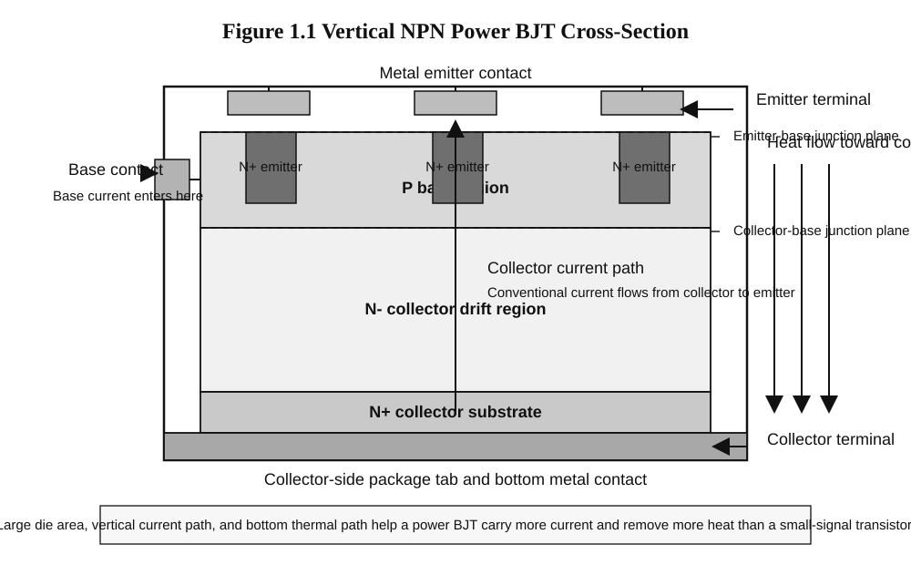
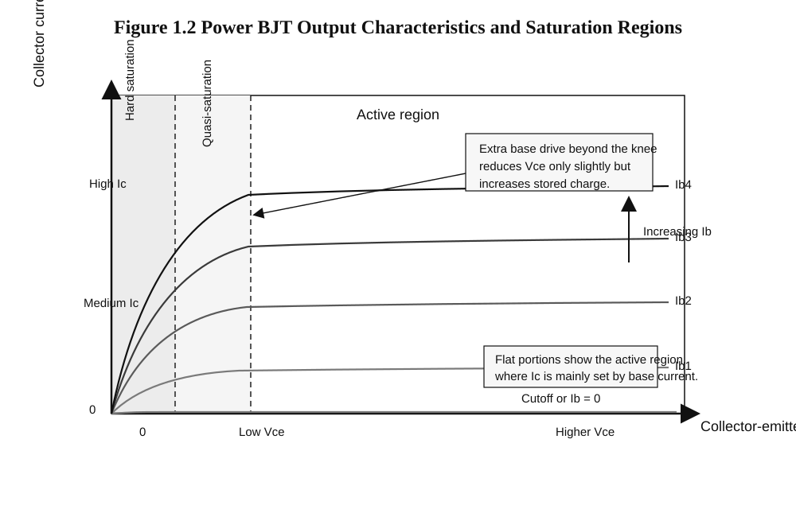
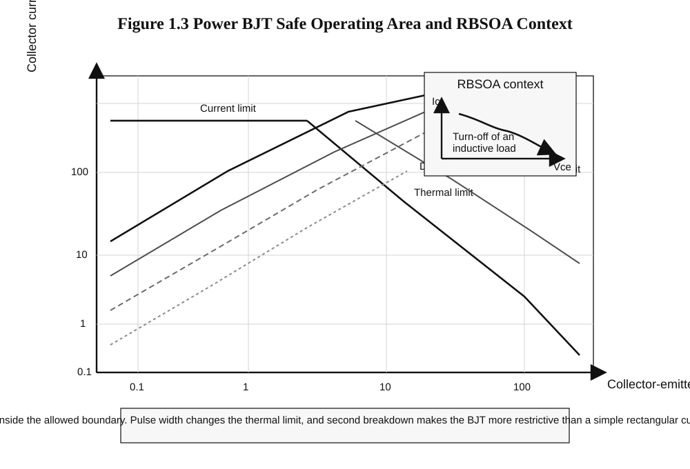
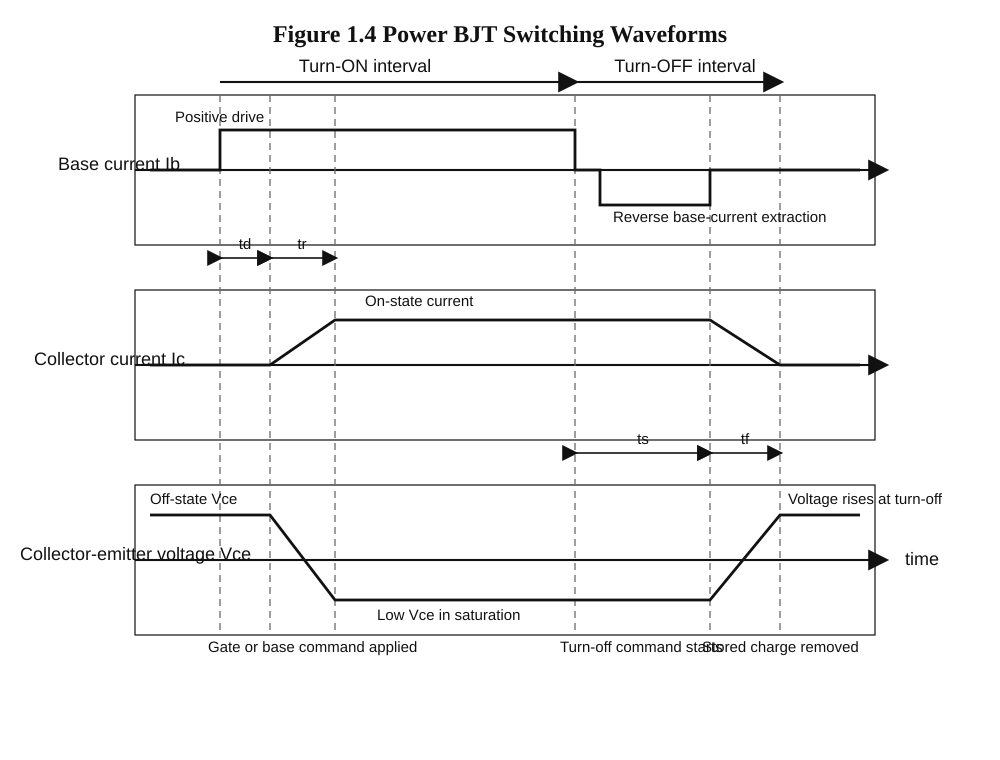

# Chapter 1.1: Power BJT

## Chapter opening

Power electronics is often introduced through converters, inverters, and modern devices such as MOSFETs and IGBTs. That approach can obscure a more basic question: what a power switch must do in an actual circuit. The **power bipolar junction transistor**, or **power BJT**, provides a useful starting point because its strengths and limits are explicit.

A power converter requires a switch that can carry large current, block large voltage, and move between ON and OFF states under external control. A small-signal transistor is not designed for that duty at the power levels used in battery chargers, UPS systems, wind-energy interfaces, or inverter auxiliaries. The power BJT was developed for this role and became one of the earliest widely used controllable solid-state power switches in choppers and switch-mode power supplies before MOSFETs and IGBTs displaced it in many newer designs [IEEE EDS, 75th Anniversary of the Transistor], [ST AN656].

This chapter introduces the power BJT as both a device and a model for studying power-semiconductor behavior. It examines structure, quasi-saturation, safe operating area, switching behavior, and key datasheet specifications, with the aim of making the main design limits legible in a real device.

## Prerequisites check

- You should know the basic idea of a PN junction diode in forward bias and reverse bias.
- You should know that a transistor can act as a switch, with **cutoff** meaning OFF and **saturation** meaning strongly ON.
- You should be comfortable with current, voltage, power, and the relation $P = VI$.
- You should know the difference between DC and AC, and you should be able to recognize that a 230 V, 50 Hz mains supply becomes a high-voltage DC bus after rectification.
- You should have a basic idea that semiconductor devices heat up when they dissipate power, and too much junction temperature can damage them.

The chapter assumes this background and treats the transistor as a physical switching device, not only as a circuit symbol.

## Core content

### 1.1.1 History of the Power BJT

Early power-control systems relied on electromechanical relays and contactors. These devices could switch current, but they were slow, noisy, bulky, and subject to contact wear. A diode could conduct large current but could not be turned ON and OFF by command. A thyristor could be triggered ON, but it was less convenient to turn OFF. Power electronics therefore needed a solid-state device that behaved as an externally commanded switch.

The invention of the transistor in 1947 opened that path [IEEE EDS, 75th Anniversary of the Transistor]. As bipolar junction transistor technology matured, devices were developed with larger junction area, heavier current capability, higher voltage blocking ability, and packages that could remove much more heat than ordinary small-signal transistors. These became **power BJTs**. For many years, they were central to choppers, switch-mode power supplies, deflection circuits, motor controls, and early inverter stages [ST AN656].

A BJT is a three-terminal device in which base current influences a much larger collector current. That made the BJT one of the earliest practical solid-state power switches that could both turn ON and turn OFF under transistor-drive control. This was a major advantage over uncontrolled rectifiers and over devices that were harder to turn OFF.

At the same time, power BJTs brought their own difficulties. They are **current-controlled** devices. This means the drive circuit must continuously supply base current while the transistor is ON. At high power, that drive current can become large. Also, when a BJT is driven deeply into saturation, stored charge inside the device makes turn-OFF slower. These two problems became major reasons why power MOSFETs and, later, IGBTs became dominant in many new designs.

In modern high-efficiency main power stages such as kilowatt-level rooftop PV string inverters, EV traction inverters, and large battery-energy-storage converters, power BJTs are usually no longer the first choice. They remain important, however, in legacy equipment, in some low-cost or specialized switching circuits, and in engineering education. Concepts such as current gain, saturation, charge storage, secondary breakdown, and safe operating area are easier to see in the BJT than in later devices. For that reason, the power BJT remains a useful entry point to the study of MOSFETs and IGBTs.

### 1.1.2 Structure, quasi-saturation, safe operating area (SOA)

A power BJT is not merely a larger small-signal transistor. It is designed to satisfy two competing requirements: high-voltage blocking in the OFF state and high-current conduction in the ON state. The internal structure must therefore provide both a robust voltage-supporting region and a low-resistance current path with adequate heat removal.

#### Physical structure of a power BJT

In power electronics, the most common discussion is around the **NPN power BJT**. The internal construction is usually vertical rather than purely lateral. That means the main current path goes from the top of the silicon die to the bottom, instead of flowing only across the surface. This helps the device use silicon area more effectively and improves current handling.

*Source: Author-generated academic monochrome vector diagram created for this chapter.*

The **emitter** is heavily doped so that it can inject carriers effectively. The **base** is thin and lightly doped enough that a relatively small base current can control a much larger collector current. The **collector** region includes a lightly doped portion, often called a drift region, so that the device can withstand higher collector-emitter voltage in the OFF state. The die area is much larger than that of a small-signal transistor, and the package is designed to connect thermally to a heat sink.

Manufacturer documents for switching BJTs often mention internal layout choices such as **cellular emitter structure** or **multi-epitaxial planar technology**. The ST13007 datasheet, for example, states that the device uses high-voltage multi-epitaxial planar technology and a cellular emitter structure to improve switching speed while maintaining wide reverse-bias safe operating area [ST13007 Datasheet]. Such details show that switching behavior and ruggedness depend on internal geometry, not only on terminal ratings.

#### Basic current relations

A transistor is a three-terminal device, so current conservation must hold. The emitter current is the sum of collector current and base current:

$$\boxed{I_E = I_C + I_B} \quad \text{(1.1)}$$

Here, $I_E$ is emitter current, $I_C$ is collector current, and $I_B$ is base current.

In the forward-active region, a useful first relation is the current gain:

$$\boxed{\beta = \frac{I_C}{I_B}} \quad \text{(1.2)}$$

Here, $\beta$ is the DC current gain. Many datasheets write it as $h_{FE}$.

Equation (1.2) is most meaningful in the active region under stated test conditions. In switching circuits, the nominal gain alone is usually not trusted. Instead, a smaller **forced beta** is chosen to guarantee that the transistor enters saturation:

$$\boxed{I_B \ge \frac{I_C}{\beta_{\text{forced}}}} \quad \text{(1.3)}$$

In this expression, $\beta_{\text{forced}}$ is not a fixed material constant. It is a design choice. Engineers often choose it much smaller than the datasheet $h_{FE}$ value so that the transistor turns ON firmly under worst-case conditions.

For example, suppose a power BJT must carry $I_C = 5 \text{ A}$ in a switching circuit. If we choose $\beta_{\text{forced}} = 5$, then the required base current is

$$I_B = \frac{5 \text{ A}}{5} = 1 \text{ A}.$$

That is a large control current. This one number already tells us why power BJTs place a heavy burden on their drive circuits.

#### Operating regions as a power switch

Four operating conditions must be distinguished in power-BJT switching: **cutoff**, **active region**, **quasi-saturation**, and **hard saturation**.

Table 1.2: Practical operating regions of a power BJT

| Region | External behavior | Junction picture | Power-electronics meaning |
|---|---|---|---|
| Cutoff | Very little collector current | Emitter-base not forward biased | Switch is OFF |
| Active region | $I_C$ approximately controlled by base current | Emitter-base forward biased, collector-base reverse biased | Used mainly during transition, not as steady ON state in power switching |
| Quasi-saturation | $V_{CE}$ has dropped significantly, but extra base drive gives diminishing reduction in $V_{CE}$ and more stored charge | The collector side is no longer behaving like a simple reverse-biased region everywhere | Common practical region in power BJTs as they are driven hard |
| Hard saturation | Both junctions effectively forward biased and stored charge is high | Deeply saturated condition | Low $V_{CE}$, but turn-OFF becomes slower |

In **cutoff**, collector current is limited to leakage and the device is OFF. In the **active region**, base current controls collector current; this region is central to transistor theory but undesirable as a steady ON state in power switching because both $V_{CE}$ and $I_C$ may be substantial at the same time. Between the active region and hard saturation, power BJTs often operate in **quasi-saturation**. In **hard saturation**, $V_{CE}$ becomes relatively small, which reduces conduction loss, but stored charge rises and turn-OFF slows.

#### What is quasi-saturation?

Power BJTs use a thicker, more lightly doped collector structure than small-signal transistors because they must block higher voltage. As base drive increases, the transition from active mode to deep saturation is therefore not abrupt. In practice, the device often enters an intermediate region in which $V_{CE}$ is already low, but additional base current produces only limited further reduction while increasing stored charge.

For this chapter, **quasi-saturation** means operation beyond the ordinary active region in which further base overdrive yields diminishing reduction in $V_{CE}$ and a larger turn-OFF penalty.

*Source: Author-generated academic monochrome vector diagram created for this chapter.*

Additional base current can help ensure turn-ON, but excessive overdrive pushes the transistor deeper toward hard saturation and increases storage time. Good design requires enough drive to establish conduction without unnecessary charge storage [ST AN656].

#### Safe operating area (SOA)

The **safe operating area**, usually shortened to **SOA**, is the region on a datasheet graph within which the transistor can operate without destructive failure under stated conditions. Maximum collector current and maximum collector-emitter voltage cannot be checked independently, because safe operation depends on the combined stress of current, voltage, pulse duration, and temperature. SOA is therefore plotted as an $I_C$-$V_{CE}$ boundary, often with separate curves for different pulse durations [onsemi AN875/D], [onsemi 2N3055 Datasheet].

The main SOA boundaries are as follows.

**Current limit.** Bond wires, silicon area, and package leads can only carry so much current.

**Thermal limit.** If $V_{CE}$ and $I_C$ are both substantial, the instantaneous power $P = V_{CE} I_C$ can become large. Over time, the junction heats. Short pulses may be tolerated better than DC, because the junction has not yet heated fully.

**Second breakdown limit.** This is especially important in BJTs. Localized current crowding can create a hot spot. The hot spot carries more current, heats more, and can rapidly destroy the device. This can happen even when the average power seems acceptable. BJT SOA is therefore more restrictive than a simple rectangular voltage-current box.

**Reverse-bias safe operating area (RBSOA).** During turn-OFF of an inductive load, the transistor may see both rising voltage and falling current while the base drive is being removed, sometimes with reverse base current extraction. Manufacturer notes treat this as a special safe-operating condition because turn-OFF can be very stressful [onsemi AN875/D], [ST AN656].

*Source: Author-generated academic monochrome vector diagram created for this chapter.*

One of the most important practical consequences is that a device may survive a high current for a very short pulse but not for DC. That is why datasheets frequently show several pulse-duration lines.

Inductive loads are particularly demanding at turn-OFF. If a transistor is carrying current in an inductor, the collector-emitter voltage can rise sharply as the current is forced to continue. The device may then see high voltage and significant current at the same moment. That combination moves the operating point across the SOA graph; if it leaves the safe region, failure can occur.

### 1.1.3 Switching characteristics and specifications

Switching behavior determines whether a power transistor is usable in a real converter circuit.

#### Why switching is not instantaneous

A power BJT does not change state instantaneously, because charge must be injected during turn-ON and removed during turn-OFF.

When the device turns ON, base current begins to build charge in the internal junctions and regions, so collector current does not jump instantly to its final value. When the transistor turns OFF, that stored charge does not disappear instantly either. This is the main reason that turn-OFF can be relatively slow.

The standard switching intervals used in datasheets are:

- **Delay time $t_d$**: the interval between application of base drive and the start of significant collector-current change.
- **Rise time $t_r$**: the interval during which collector current rises to its ON-state value and $V_{CE}$ falls.
- **Storage time $t_s$**: after turn-OFF drive begins, the transistor may still conduct heavily because stored charge remains. This interval is storage time.
- **Fall time $t_f$**: the interval during which collector current actually falls and $V_{CE}$ rises to the OFF-state value.

For power BJTs, storage time is often the most revealing interval because it captures the turn-OFF penalty created by stored charge.

*Source: Author-generated academic monochrome vector diagram created for this chapter.*

During turn-ON, the drive circuit pushes current into the base. At first, the transistor is still mostly OFF, so collector current is low and $V_{CE}$ is high. This is the delay interval. The device then moves toward conduction: collector current rises and collector-emitter voltage falls until a low-$V_{CE}$ ON state is reached.

During turn-OFF, base drive is removed, and many circuits apply reverse base current to extract stored charge more quickly. The transistor nevertheless continues to conduct for a storage interval before collector current falls rapidly. Deep saturation therefore improves ON-state voltage drop at the cost of slower turn-OFF.

#### Conduction loss and base-drive burden

When the transistor is ON in saturation, its collector-emitter voltage is not zero. It may be 1 V, 2 V, or more, depending on current and drive conditions. That causes conduction loss.

A first practical estimate is

$$\boxed{P_{\text{cond}} \approx V_{CE(\text{sat})} I_C} \quad \text{(1.4)}$$

Here, $P_{\text{cond}}$ is conduction loss inside the transistor, $V_{CE(\text{sat})}$ is the collector-emitter saturation voltage, and $I_C$ is collector current.

If the transistor is ON only for a fraction $D$ of each switching cycle, where $D$ is the duty ratio, then the average conduction loss is approximately

$$\boxed{P_{\text{cond,avg}} \approx D\,V_{CE(\text{sat})} I_C} \quad \text{(1.5)}$$

The drive circuit also consumes power because it must deliver base current. An approximate average base-drive power is

$$\boxed{P_{B,\text{avg}} \approx D\,V_{BE(\text{sat})} I_B} \quad \text{(1.6)}$$

In this equation, $V_{BE(\text{sat})}$ is the base-emitter saturation voltage.

These equations show that a power BJT dissipates power both in its collector-emitter path and in the base-drive circuit. The need for continuous base current is one reason later voltage-driven devices became attractive.

#### Switching-loss estimate

During switching, voltage and current overlap. That overlap creates switching loss. A simple first estimate, using a triangular overlap during rise and fall, is

$$\boxed{E_{\text{sw,approx}} \approx \frac{1}{2}V_{CC} I_C (t_r + t_f)} \quad \text{(1.7)}$$

Here, $E_{\text{sw,approx}}$ is approximate switching energy per cycle, $V_{CC}$ is the supply or blocking voltage, $I_C$ is the switched collector current, and $t_r$, $t_f$ are rise and fall times.

Then average switching power is approximately

$$\boxed{P_{\text{sw,approx}} \approx f_s E_{\text{sw,approx}}} \quad \text{(1.8)}$$

where $f_s$ is the switching frequency.

For BJTs, however, this approximation often underestimates turn-OFF loss when the device has been driven deeply into saturation. Storage time keeps collector current flowing before the fall interval really begins, so real turn-OFF energy may be larger than Equation (1.7) suggests.

#### Temperature and thermal specification

All semiconductor ratings ultimately reduce to a thermal question: how hot does the junction become?

A simple thermal relation from junction to case is

$$\boxed{T_J \approx T_C + P_D R_{\theta JC}} \quad \text{(1.9)}$$

Here, $T_J$ is junction temperature, $T_C$ is case temperature, $P_D$ is device power dissipation, and $R_{\theta JC}$ is thermal resistance from junction to case.

The relation shows that, for a given case temperature, higher dissipation raises the junction temperature, while lower thermal resistance helps. Later, when heat sinks are studied in Module 2, this idea will be extended to the full path from junction to ambient.

#### Worked numerical example

The following estimate uses values from a real switching transistor.

Consider the ST13007, a high-voltage fast-switching NPN power transistor used in switch-mode power supplies [ST13007 Datasheet]. Its datasheet gives, among other values, a collector-emitter saturation voltage of about 1 V at collector current 2 A and base current 0.4 A, and a base-emitter saturation voltage of about 1.2 V at the same operating point. Its junction-to-case thermal resistance is 1.56 °C/W.

Imagine that this transistor is used in a low-power auxiliary SMPS inside a rooftop solar inverter control cabinet. During each cycle, the transistor is ON for duty ratio 0.35 and carries 2 A when ON. Ignore switching loss for this first estimate.

First, what forced beta is the design using?

$$\beta_{\mathrm{forced}} = \frac{I_C}{I_B} = \frac{2}{0.4} = 5.$$

The design therefore uses forced beta 5.

Next, the average conduction loss inside the transistor is

$$P_{\mathrm{cond,avg}} \approx D\,V_{CE,\mathrm{sat}} I_C.$$

Substituting the numbers,

$$P_{\mathrm{cond,avg}} \approx 0.35 \times 1\,\mathrm{V} \times 2\,\mathrm{A} = 0.70\,\mathrm{W}.$$

Now estimate the average base-drive power:

$$P_{B,\mathrm{avg}} \approx D\,V_{BE,\mathrm{sat}} I_B.$$

So,

$$P_{B,\mathrm{avg}} \approx 0.35 \times 1.2\,\mathrm{V} \times 0.4\,\mathrm{A} = 0.168\,\mathrm{W}.$$

This 0.168 W is not dissipated in the collector-emitter path, but it is still power that the drive circuit must supply.

Finally, estimate the junction temperature rise above the case due only to the transistor’s average conduction loss:

$$T_J - T_C \approx P_D R_{\theta\mathrm{JC}}.$$

Taking $P_D$ as approximately 0.70 W for this simple estimate,

$$T_J - T_C \approx 0.70 \times 1.56 = 1.092.$$

So the junction is about 1.092 °C hotter than the case.

If the case temperature is 80 °C, then the estimated junction temperature is

$$T_J \approx 80 + 1.092 \approx 81.1.$$

So the estimated junction temperature is about 81.1 °C.

This estimate is intentionally incomplete: it ignores switching loss, case-to-ambient heating, and circuit-dependent variation in saturation voltage. It nevertheless shows that collector loss can be modest in a low-power auxiliary converter while the required base-drive current remains substantial.

#### Reading key specifications in a datasheet

A power-transistor datasheet contains many numbers. The most important ones are grouped below.

Table 1.3: Key power-BJT specifications and what they mean

| Symbol | Meaning | Why you should care |
|---|---|---|
| $V_{CEO}$ or $V_{CEO(\text{sus})}$ | Collector-emitter voltage rating with base open | Tells you the off-state voltage limit in a common test condition |
| $V_{CES}$ | Collector-emitter voltage with base shorted to emitter | Often larger than $V_{CEO}$; useful in off-state stress interpretation |
| $I_C$, $I_{CM}$ | Continuous and peak collector current | Needed for load current and transient current checks |
| $h_{FE}$ | DC current gain under specified test conditions | Helps estimate base-drive needs, but does not replace forced-beta design |
| $V_{CE(\text{sat})}$ | Collector-emitter saturation voltage | Directly affects ON-state loss |
| $V_{BE(\text{sat})}$ | Base-emitter saturation voltage | Helps estimate base-drive burden |
| $t_s$, $t_f$ and sometimes $t_d$, $t_r$ | Storage, fall, delay, and rise times | Show switching speed and turn-OFF difficulty |
| SOA / RBSOA | Safe current-voltage operating boundaries | Prevents destructive operation during switching and faults |
| $P_{\text{TOT}}$ | Total dissipation | Gives a package-level dissipation limit under stated conditions |
| $R_{\theta JC}$, $T_J$ max | Thermal resistance and maximum junction temperature | Needed to judge temperature rise and heat-sink need |

A device with higher $h_{FE}$ is not automatically better for switching service. Voltage rating, $V_{CE(\text{sat})}$, switching times, SOA, thermal resistance, and the required base drive matter at least as much.

## Worked interpretation exercise

The [ST13007 datasheet](https://www.st.com/resource/en/datasheet/st13007.pdf) provides a compact example of how a switching power-BJT datasheet is interpreted.

The title and description identify the device as a “high voltage fast-switching NPN power transistor.” The description states that it uses multi-epitaxial planar technology and a cellular emitter structure for high switching speed and wide RBSOA [ST13007 Datasheet]. Even before the numeric tables are read, the intended use is clear: high-voltage switching service such as switch-mode power supplies, not low-voltage relay replacement.

The absolute maximum ratings list $V_{CES} = 700 \text{ V}$ and $V_{CEO} = 400 \text{ V}$, along with continuous collector current $I_C = 8 \text{ A}$ and peak collector current $I_{CM} = 16 \text{ A}$ [ST13007 Datasheet]. This places the device in the high-voltage BJT family. A rectified 230 V AC supply is about $325 \text{ V}$ DC, so a transistor with $V_{CEO} = 400 \text{ V}$ is in the correct general class for such service, though the design would still need margin and usually a snubber or clamp for switching spikes.

The thermal data give maximum junction temperature $T_J = 150^\circ\text{C}$ and junction-to-case thermal resistance $R_{\theta JC} = 1.56^\circ\text{C/W}$ [ST13007 Datasheet]. Heat-sink design therefore cannot be ignored. Even an electrically strong device can still fail thermally.

The saturation and gain data must be read together. The table gives $V_{CE(\text{sat})} = 1 \text{ V}$ at $I_C = 2 \text{ A}$ and $I_B = 0.4 \text{ A}$, and $V_{BE(\text{sat})} = 1.2 \text{ V}$ at the same operating point [ST13007 Datasheet]. It also gives DC current gain $h_{FE}$ values such as 16 to 40 at $I_C = 2 \text{ A}$ and $V_{CE} = 5 \text{ V}$, depending on gain group [ST13007 Datasheet].

These entries describe two different operating conditions. The $h_{FE}$ value is measured in the active region under specified voltage conditions, whereas the saturation voltage is measured under hard switching-drive conditions. It would therefore be incorrect to say, “The transistor has gain 20, therefore $I_B = I_C/20$ is enough for switching.” The datasheet itself shows that for $I_C = 2 \text{ A}$, the saturation test uses $I_B = 0.4 \text{ A}$, which corresponds to forced beta 5, not 20.

The switching-time entries also depend on context. For a resistive-load test at $V_{CC} = 300 \text{ V}$ and $I_C = 2 \text{ A}$, the datasheet gives storage time up to $4.5 \,\mu\text{s}$ and fall time about $350 \text{ ns}$ [ST13007 Datasheet]. For an inductive-load test, it gives different storage and fall times under specified clamp and reverse-base-drive conditions [ST13007 Datasheet]. Switching speed therefore depends on the test circuit; there is no single universal switching time.

The datasheet includes both a safe operating area plot and a reverse-biased SOA plot [ST13007 Datasheet]. Their presence indicates intended use in real switching conditions where turn-OFF stress matters.

Table 1.4 summarizes the interpretation.

Table 1.4: Interpreting the ST13007 datasheet

| Datasheet item | What it tells us | Design meaning |
|---|---|---|
| Title and description | High-voltage fast-switching NPN power transistor | Intended for SMPS-type switching, not general low-voltage only |
| `V_CEO = 400 V`, `V_CES = 700 V` | High off-state voltage class | Suitable general class for off-line DC-bus switching with proper clamp margin |
| `I_C = 8 A` | Current capability | Must still be checked against SOA, not used blindly |
| `V_CE,sat = 1 V` at `2 A` collector current and `0.4 A` base current | ON-state drop under strong base drive | Conduction loss is significant but manageable at moderate current |
| `h_FE` grouping | Gain varies by device group and test condition | Active-region gain is not the same as switch-design forced beta |
| `t_s` and `t_f` data | Turn-OFF charge storage is real and measurable | Deep saturation slows turn-OFF and increases loss |
| SOA and RBSOA figures | Voltage and current must be checked together | Inductive switching can be destructive without protection |
| `R_thetaJC` and maximum `T_J` | Thermal path matters | Heat sink and temperature rise must be verified |

A datasheet is best read as a coordinated set of limits and operating clues, not as a collection of isolated numbers.

## How this matters in renewable-energy systems

Even when main renewable-energy converter stages use MOSFETs or IGBTs, the power BJT remains instructive. Older or lower-cost auxiliary supplies in inverters, chargers, and control cabinets often used high-voltage switching BJTs, and the same design questions appear in modern devices: drive requirement, conduction drop, switching loss, SOA, and thermal limits.

Renewable-energy systems also expose power devices to the stresses emphasized in this chapter: inductive current, high DC voltage, repeated switching, heat, and fault transients. The BJT makes these limits particularly visible, which is why it remains a useful first device in power-electronics study.

## Chapter summary

- A **power BJT** is a bipolar junction transistor designed for higher current, higher voltage, and higher heat dissipation than a small-signal transistor.
- The power BJT was one of the earliest practical controllable solid-state switches used in power converters before MOSFETs and IGBTs became dominant in many new designs [IEEE EDS, 75th Anniversary of the Transistor], [ST AN656].
- In a BJT, emitter current, collector current, and base current are related by $I_E = I_C + I_B$.
- In the active region, the current gain is $\beta = I_C/I_B$, but switching design usually uses a smaller **forced beta** to ensure saturation.
- A power BJT has operating regions including cutoff, active region, quasi-saturation, and hard saturation. Quasi-saturation is important because extra base drive gives diminishing reduction in $V_{CE}$ while increasing stored charge.
- **Safe operating area (SOA)** is a current-voltage-time-temperature boundary, not a single number. It is shaped by current limit, thermal limit, and second breakdown [onsemi AN875/D], [onsemi 2N3055 Datasheet].
- Power BJTs store charge, so switching is not instantaneous. Important switching intervals include delay time, rise time, storage time, and fall time.
- ON-state conduction loss is approximately $P_{\text{cond}} \approx V_{CE(\text{sat})} I_C$, while average base-drive power is approximately $P_{B,\text{avg}} \approx D\,V_{BE(\text{sat})} I_B$.
- A simple thermal estimate is $T_J \approx T_C + P_D R_{\theta JC}$, but real temperature rise also depends on the rest of the thermal path.
- In renewable-energy systems, power BJTs are more important today as a conceptual foundation, an auxiliary-stage device in some designs, and a bridge to understanding later devices such as MOSFETs and IGBTs.

## Further reading

- [ST13007 Datasheet, STMicroelectronics](https://www.st.com/resource/en/datasheet/st13007.pdf) — A real high-voltage switching power-BJT datasheet with saturation data, switching times, SOA, and RBSOA.
- [2N3055 / MJ2955 Datasheet, onsemi](https://www.onsemi.com/download/data-sheet/pdf/2n3055-d.pdf) — A classic power-transistor datasheet that is especially useful for learning safe operating area and second-breakdown interpretation.
- [AN875/D: Power Transistor Safe Operating Area, onsemi](https://www.onsemi.com/pub/Collateral/AN875-D.PDF) — A concise official note on forward-bias and reverse-bias SOA and why switching stress must be checked on an $I_C$–$V_{CE}$ plot.
- [AN656: Power Transistors - Devices and Datasheets, STMicroelectronics](https://www.st.com/resource/en/application_note/an656-power-transistors--devices-and-datasheets-stmicroelectronics.pdf) — A practical manufacturer note on reading power-transistor datasheets, base-drive concerns, temperature effects, and RBSOA.
- [The Transistor at 75, IEEE Electron Devices Society / IEEE Spectrum](https://spectrum.ieee.org/invention-of-the-transistor) — A useful historical overview of the transistor’s development, which helps place the power BJT in the larger evolution of power semiconductor devices.
