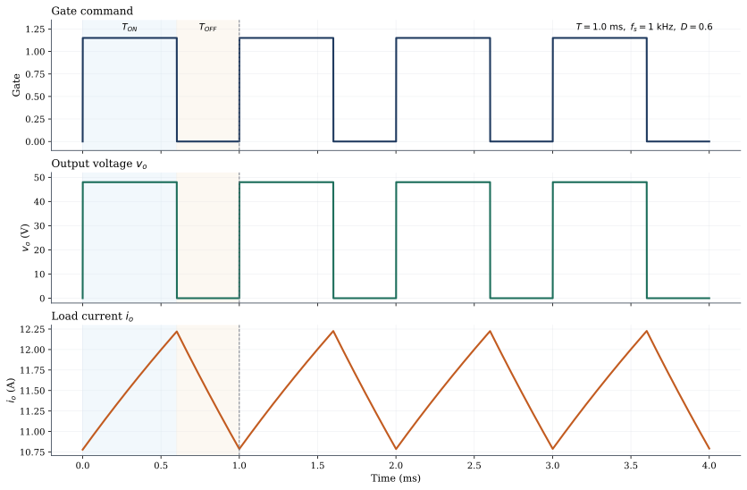

# Chapter 4.1: Fundamentals of DC Choppers

## Chapter opening

Controlled rectifiers convert AC into controllable DC, but many modern power-electronic systems begin with DC already available. A battery delivers DC. A solar PV string delivers DC. A DC link inside an inverter is DC. In such cases, the basic problem is no longer AC-to-DC conversion, but efficient control of one DC level by another.

A **DC chopper**, now more commonly described as a **DC-DC converter**, solves that problem by rapid switching rather than by continuous dissipation [Rashid, *Power Electronics: Circuits, Devices and Applications*, 4e], [Mohan, *First Course on Power Electronics and Drives*]. This chapter introduces the operating principle of chopping, the meaning of **duty cycle**, the classical control methods of **Time-Ratio Control** and **Current-Limit Control**, and the quadrant-based classification of choppers from **Type A** to **Type E**. These ideas provide the conceptual basis for the converter topologies studied in the rest of Module 4.

## Prerequisites check

- You should remember the switching behavior of power devices from Chapters 1.1 to 1.5.
- You should be comfortable with the idea that an inductor opposes sudden change of current and a capacitor opposes sudden change of voltage.
- You should know the basic power relation $P = VI$ and the difference between average value and instantaneous value.
- You should be able to follow a simple time waveform with ON interval, OFF interval, and period.
- You should remember from Chapter 2.2 why a freewheeling path is needed with inductive loads.

If average value, RMS value, or inductive-load behavior feels uncertain, a short review before continuing will help.

## Core content

### 4.1.1 Principle of chopper operation; duty cycle

#### Why chopping works

Suppose a $48 \text{ V}$ battery must supply a load that requires about $24 \text{ V}$ on average. One approach would be to drop the excess voltage across a resistor or a linear transistor. That method is simple, but inefficient. If the load current is $10 \text{ A}$, dropping $24 \text{ V}$ wastes

$$24 \times 10 = 240 \text{ W}.$$

Such loss produces substantial heating and lowers efficiency severely.

A chopper avoids that loss by operating the switch mainly in two states:

- fully ON, where switch voltage drop is small and conduction loss is low
- fully OFF, where current through the switch is ideally zero and loss is again low

Because the switch does not remain in a high-voltage, high-current intermediate state for long, switching control is far more efficient than linear control [Mohan, Undeland, Robbins, *Power Electronics: Converters, Applications and Design*, 3e], [Rashid, *Power Electronics: Circuits, Devices and Applications*, 4e].

During the ON interval, the source is connected to the load. During the OFF interval, the source is disconnected. Repetition of these intervals produces a pulsed output waveform whose average value depends on the fraction of each cycle for which the switch remains ON.

#### A first numerical example

Let a switch connect a $48 \text{ V}$ source to a load for $0.6 \text{ ms}$ and disconnect it for $0.4 \text{ ms}$, repeating continuously.

The switching period is

$$\boxed{T = T_{ON} + T_{OFF}} \quad \text{(13.1)}$$

so

$$T = 0.6 \text{ ms} + 0.4 \text{ ms} = 1.0 \text{ ms}.$$

The switching frequency is

$$\boxed{f_s = \frac{1}{T}} \quad \text{(13.2)}$$

hence

$$f_s = \frac{1}{1.0 \times 10^{-3}} = 1000 \text{ Hz} = 1 \text{ kHz}.$$

The **duty cycle** or **duty ratio** is defined as

$$\boxed{D = \frac{T_{ON}}{T}} \quad \text{(13.3)}$$

so in this case

$$D = \frac{0.6}{1.0} = 0.6.$$

For the simplest ideal step-down chopper, the output voltage is $V_s$ during the ON interval and $0$ during the OFF interval. The average output voltage is therefore

$$V_{o,avg} = \frac{1}{T}\left(\int_0^{T_{ON}} V_s\,dt + \int_{T_{ON}}^T 0\,dt \right).$$

This reduces to

$$V_{o,avg} = \frac{1}{T}\left(V_sT_{ON}\right) = V_s\frac{T_{ON}}{T}.$$

Hence

$$\boxed{V_{o,avg} = D\,V_s} \quad \text{(13.4)}$$

For $V_s = 48 \text{ V}$ and $D = 0.6$,

$$V_{o,avg} = 0.6 \times 48 = 28.8 \text{ V}.$$

The switch node is still a pulse waveform. The value $28.8 \text{ V}$ is its average. Whether the current is smooth or strongly pulsating depends on the load and on any inductive or capacitive energy storage connected to it.

#### What the load sees

With a purely resistive load, both voltage and current pulse strongly. With an inductive load, current changes more gradually because an inductor opposes sudden change of current [Singh and Khanchandani, *Power Electronics*].

An inductive load also requires a **freewheeling diode** or an equivalent alternate path. When the main switch turns OFF, inductive current cannot fall to zero instantaneously. If no path is available, the switch voltage may rise to a dangerous value. This requirement is fundamental in chopper circuits.

Figure 13.1 is shown as a generated circuit schematic and a simulation-backed waveform set for the same step-down chopper example.

#### Duty cycle and efficiency

Equation (13.4) gives the basic control relation for an ideal step-down chopper: average output voltage is proportional to duty cycle. Thus

- if $D = 0.25$, then $V_{o,avg} = 0.25V_s$
- if $D = 0.50$, then $V_{o,avg} = 0.50V_s$
- if $D = 0.80$, then $V_{o,avg} = 0.80V_s$

Later converter topologies do not all obey Equation (13.4), but the control principle remains the same: switching timing determines average power flow.

The efficiency advantage follows from the switch power loss

$$p_{sw}(t) = v_{sw}(t)i_{sw}(t).$$

When the switch is ideally ON, $v_{sw}$ is small. When it is ideally OFF, $i_{sw}$ is small. In both states, instantaneous loss is therefore low. Real converters also have switching loss during transitions and conduction loss in the ON state, but efficient operation still depends on keeping the device close to these low-loss states [Mohan, Undeland, Robbins, *Power Electronics: Converters, Applications and Design*, 3e].

#### Common misconceptions

The output of a chopper is not automatically a smooth DC voltage. The switch-node voltage is usually pulsed, and smoothing depends on inductors, capacitors, and load dynamics.

Duty cycle also does not determine RMS output directly. In the ideal step-down case it gives a simple average-voltage relation. RMS value, ripple, and current waveform must be analyzed separately.

### 4.1.2 Control strategies: Time-Ratio Control and Current-Limit Control

#### General idea

Once the switching principle is clear, the next question is how the ON and OFF intervals should be selected. Two classical methods are central to introductory chopper analysis:

- **Time-Ratio Control (TRC)**
- **Current-Limit Control**

In **Time-Ratio Control**, the average output is adjusted by changing the ratio of ON time to total period. In **Current-Limit Control**, switching is determined by current thresholds rather than by a predetermined timing pattern.

#### Constant-frequency Time-Ratio Control

In **constant-frequency TRC**, the switching period $T$ is fixed, so the switching frequency $f_s$ remains constant. The duty cycle is changed by adjusting $T_{ON}$ and $T_{OFF}$ while keeping their sum unchanged. This is the classical form of **pulse-width modulation (PWM)**.

Suppose a chopper operates at $20 \text{ kHz}$. Then

$$T = \frac{1}{20\,000} = 50 \,\mu\text{s}.$$

If an ideal step-down chopper must produce $36 \text{ V}$ from a $96 \text{ V}$ source, then

$$D = \frac{V_{o,avg}}{V_s} = \frac{36}{96} = 0.375.$$

Therefore

$$T_{ON} = DT = 0.375 \times 50 \,\mu\text{s} = 18.75 \,\mu\text{s}$$

and

$$T_{OFF} = 50 - 18.75 = 31.25 \,\mu\text{s}.$$

The switching frequency remains fixed at $20 \text{ kHz}$ while the pulse width changes according to the required output.

Constant-frequency control is widely used because output-filter design becomes easier when ripple frequency is known in advance. TI's note on buck regulators emphasizes that accurate switching frequency matters directly to inductor and capacitor selection [TI, *The Importance of Accurate Switching Frequency and Current Limit When Selecting Buck Regulators*].

#### Variable-frequency Time-Ratio Control

In **variable-frequency TRC**, the duty ratio is changed by altering the switching period itself. One common approach keeps $T_{ON}$ constant and varies $T_{OFF}$. Another keeps $T_{OFF}$ constant and varies $T_{ON}$. In either case, switching frequency changes with operating condition.

Assume $T_{ON} = 20 \,\mu\text{s}$ in both cases.

- Case 1: $T_{OFF} = 20 \,\mu\text{s}$
- Case 2: $T_{OFF} = 60 \,\mu\text{s}$

For Case 1,

$$T = 20 + 20 = 40 \,\mu\text{s}, \qquad D = \frac{20}{40} = 0.5$$

and

$$f_s = \frac{1}{40 \,\mu\text{s}} = 25 \text{ kHz}.$$

For Case 2,

$$T = 20 + 60 = 80 \,\mu\text{s}, \qquad D = \frac{20}{80} = 0.25$$

and

$$f_s = \frac{1}{80 \,\mu\text{s}} = 12.5 \text{ kHz}.$$

Thus both duty cycle and frequency change together.

Variable-frequency control can be useful in some classical circuits, but it complicates filter design and makes EMI and acoustic behavior less uniform. For that reason, fixed-frequency PWM dominates many modern converters.

#### Current-Limit Control

In many DC loads, especially inductive loads, current is the primary quantity of interest. **Current-Limit Control** uses current thresholds rather than a fixed timing pattern. The controller sets an upper limit $I_U$ and a lower limit $I_L$:

- when current rises to $I_U$, the switch turns OFF
- when current falls to $I_L$, the switch turns ON

The current therefore oscillates within a band instead of drifting freely.

The governing relation is

$$\boxed{\frac{di}{dt} = \frac{v_L}{L}} \quad \text{(13.5)}$$

where $v_L$ is the inductor voltage and $L$ is the inductance. During the ON interval, the applied voltage causes current to rise. During freewheeling or the OFF interval, the inductor voltage changes so that current falls.

If the current ripple band is reasonably narrow, a useful first estimate of average current is

$$\boxed{I_{o,avg} \approx \frac{I_U + I_L}{2}} \quad \text{(13.6)}$$

This is only an estimate, not a full dynamic law.

Suppose an inductive load is controlled between

- $I_L = 18 \text{ A}$
- $I_U = 22 \text{ A}$

Then

$$I_{o,avg} \approx \frac{18 + 22}{2} = 20 \text{ A}.$$

Current-limit control is attractive when current itself must be bounded, as in motor drives, battery charging, and converter protection. Unlike constant-frequency PWM, however, its switching frequency usually varies with source voltage, inductance, back EMF, and load condition because current-rise and current-fall slopes are not fixed.

**Image prompt for Figure 13.2:** Create a textbook-style comparison of chopper control strategies. Show two panels. In the first panel, illustrate constant-frequency Time-Ratio Control with equally spaced gate pulses of fixed period but different pulse widths, and corresponding output-voltage pulses. In the second panel, illustrate Current-Limit Control with load current oscillating between lower limit $I_L$ and upper limit $I_U$, causing unequal switching intervals and variable switching frequency. Label $T_{ON}$, $T_{OFF}$, $D$, $I_L$, $I_U$, and indicate fixed versus variable frequency clearly. Use monochrome engineering style with axes and annotations.

#### Comparing the control strategies

Table 13.1 summarizes the main distinctions.

Table 13.1: Introductory comparison of chopper control strategies

| Control strategy | What is directly controlled | What usually stays constant | Main advantage | Main caution |
| --- | --- | --- | --- | --- |
| Constant-frequency TRC | Duty cycle by changing pulse width | Switching frequency | Easier filter design and predictable ripple frequency | Current still depends on load conditions |
| Variable-frequency TRC | Duty cycle by changing ON or OFF interval and hence period | One timing segment may be fixed | Simple in some classical circuits | Filter and EMI behavior change with frequency |
| Current-limit control | Current band between $I_L$ and $I_U$ | Current limits | Good for current-sensitive loads and protection | Switching frequency usually varies |

### 4.1.3 Classification of choppers: Type-A, B, C, D and E - operating principle, output waveforms, applications

#### The quadrant idea

Choppers are also classified by the permitted signs of output voltage and output current. This quadrant-based view is important because converter behavior is defined not only by average output magnitude, but also by allowable directions of current and power flow [Singh and Khanchandani, *Power Electronics*], [Bimbhra, *Power Electronics*].

Use the following sign convention:

- $V_o$ is positive when the terminal marked positive is at higher potential
- $I_o$ is positive when current flows from converter to load

The instantaneous output power is

$$\boxed{p_o = v_o i_o} \quad \text{(13.7)}$$

and the average power direction follows the signs of average voltage and current.

Table 13.2 gives the basic meaning of the four quadrants.

Table 13.2: Sign meaning in the output $V_o$-$I_o$ plane

| Quadrant | Voltage sign | Current sign | Power-flow interpretation |
| --- | --- | --- | --- |
| I | Positive | Positive | Power flows from source to load |
| II | Positive | Negative | Regenerative power returns from load to source |
| III | Negative | Negative | Reversed-voltage, reversed-current power flow |
| IV | Negative | Positive | Power flows with negative voltage and positive current |

**Image prompt for Figure 13.3:** Create a clean textbook-style four-quadrant plot of output voltage $V_o$ on the horizontal axis and output current $I_o$ on the vertical axis. Label Quadrants I, II, III, and IV. Superimpose the classical chopper classifications: Type A in Quadrant I, Type B in Quadrant II, Type C spanning Quadrants I and II, Type D spanning Quadrants I and IV, and Type E spanning all four quadrants. Add concise annotations such as "motoring," "regeneration," "voltage reversal," and "four-quadrant operation." Use monochrome engineering style with clear arrows and labels.

#### Type-A chopper

The **Type-A chopper** operates in the **first quadrant**, so both output voltage and output current are positive. Power flows from source to load. With an inductive load, current remains positive and typically freewheels through a diode during the OFF interval. In modern terminology, this is the classical **step-down chopper** or **buck-type** case [Rashid, *Power Electronics: Circuits, Devices and Applications*, 4e].

Typical applications include DC motor motoring operation, battery-fed DC loads, step-down converter stages, and battery charging from a higher-voltage DC source.

#### Type-B chopper

The **Type-B chopper** operates in the **second quadrant**. Output voltage is positive, but output current is negative according to the adopted sign convention. This requires a load capable of returning energy, such as a DC motor under regenerative braking or an inductive load with stored energy and back EMF.

In Type-B operation, power flows from load back to source. The classical application is **regeneration**, where energy is returned to the source instead of being dissipated in a resistor [Singh and Khanchandani, *Power Electronics*].

#### Type-C chopper

The **Type-C chopper** combines Type-A and Type-B behavior and therefore operates in the **first and second quadrants**. Output voltage remains positive, while output current may be positive or negative.

This arrangement permits forward motoring and forward regenerative braking without reversing output-voltage polarity. It is therefore useful in DC drives and battery systems that must alternate between power delivery and energy recovery.

#### Type-D chopper

The **Type-D chopper** operates in the **first and fourth quadrants**. Output current remains positive, while output voltage can be positive or negative.

This type is used when the converter must reverse the applied voltage across an inductive load while current continuity keeps the instantaneous current in one direction. It is a useful intermediate case between simple one-quadrant operation and full bridge-based reversal.

#### Type-E chopper

The **Type-E chopper** is the **four-quadrant chopper**. Both output voltage and output current can reverse, so operation is possible in all four quadrants.

This is the most flexible classical type. It supports forward motoring, forward regeneration, reverse motoring, and reverse regeneration. In modern hardware, equivalent behavior is commonly realized with an **H-bridge** or another full-bridge arrangement.

#### Summary of the five types

Table 13.3 brings the classification together.

Table 13.3: Classical chopper classification at a glance

| Chopper type | Operating quadrants | Output voltage sign | Output current sign | Main power-flow idea | Typical application picture |
| --- | --- | --- | --- | --- | --- |
| Type A | I | Positive | Positive | Source to load | Step-down control, motoring, buck-type operation |
| Type B | II | Positive | Negative | Load to source | Regenerative braking, energy return |
| Type C | I and II | Positive | Positive or negative | Motoring and regeneration with same voltage polarity | DC drives, battery systems with forward motoring and braking |
| Type D | I and IV | Positive or negative | Positive | Reversible voltage with one current direction at a time | Reversible-voltage inductive-load control |
| Type E | I, II, III, IV | Positive or negative | Positive or negative | Full bidirectional power and direction control | Four-quadrant drives, H-bridge systems, advanced EV and storage interfaces |

The pattern is easier to remember if each type is read in terms of what may reverse: Type A reverses neither voltage nor current, Type C allows current reversal with one voltage polarity, Type D allows voltage reversal with one current polarity, and Type E allows both.

#### Classical names and modern names

Modern converter design more often uses names such as buck, boost, half-bridge, full-bridge, bidirectional buck-boost, and H-bridge than the older Type-A to Type-E notation. The classical classification remains useful because it states immediately which signs of voltage, current, and power flow are possible.

## Worked interpretation exercise

The [TI LM2596 product page](https://www.ti.com/product/LM2596) provides a compact practical example of chopper terminology in modern form. TI describes the LM2596 as a **4.5 V to 40 V, 3 A low component count step-down regulator**, lists the topology as **buck**, states a **150 kHz fixed-frequency internal oscillator**, and includes **over current protection** and **thermal shutdown** [TI LM2596 Product Page]. TI also lists an evaluation module operating from **7 V to 40 V input** and producing **5 V at 3 A** [TI LM2596 Product Page].

These statements translate directly into the language of this chapter. A **step-down regulator** or **buck** converter corresponds to Type-A, or first-quadrant, chopper behavior. A **150 kHz fixed-frequency internal oscillator** indicates constant-frequency Time-Ratio Control. **Over current protection** shows that practical converters often regulate voltage in normal operation while still incorporating current-limit behavior for protection. The **7 V to 40 V input, 5 V at 3 A** specification identifies the intended function: efficient reduction of DC voltage from a higher input level.

Table 13.4 summarizes that interpretation.

Table 13.4: Interpreting the LM2596 as a practical chopper example

| Product-page statement | Plain-language interpretation | Chapter connection |
| --- | --- | --- |
| Step-down regulator | Output average voltage is below input | Type-A chopper behavior |
| Topology: buck | Classical first-quadrant DC-DC conversion | Source-to-load power flow |
| 150 kHz fixed-frequency oscillator | Switching period is intentionally held constant | Constant-frequency Time-Ratio Control |
| Over current protection | Current must be bounded under fault or overload | Practical current-limit function |
| 7 V to 40 V input, 5 V at 3 A EVM | Real example of controlled DC voltage reduction | Chopper used as a practical power supply stage |

The terminology of modern switching regulators is different from the older language of choppers, but the underlying operating ideas are the same: rapid switching, duty-ratio control, energy smoothing, and protection.

## How this matters in renewable-energy systems

DC choppers are central to renewable-energy and electrified systems because those systems contain many DC interfaces operating at different voltage and current levels. In a PV system, the panel operating voltage is not usually the same as the battery voltage or DC-bus voltage. In battery charging, converter action determines applied voltage and charging current. In EVs and storage systems, bidirectional converters must support both energy delivery and energy recovery. In DC microgrids, multiple sources and storage units exchange power through converter stages whose behavior is best understood in terms of duty cycle, current control, and permitted power-flow quadrants.

For that reason, the ideas developed in this chapter extend beyond introductory circuit forms. Duty cycle explains how switching controls average output. Time-Ratio Control and Current-Limit Control describe two basic control approaches. The Type-A to Type-E classification identifies whether voltage, current, or power flow may reverse. Those questions recur throughout later study of MPPT converters, bidirectional battery interfaces, EV regenerative braking, and DC-link regulation.

## Chapter summary

- A **DC chopper** obtains a controllable DC output from a DC source by rapid ON-OFF switching [Rashid, *Power Electronics: Circuits, Devices and Applications*, 4e].
- The switching period is $T = T_{ON} + T_{OFF}$ and the switching frequency is $f_s = 1/T$.
- The **duty cycle** is $D = T_{ON}/T$.
- For the ideal step-down chopper, the average output voltage is $V_{o,avg} = D V_s$.
- The efficiency advantage of a chopper comes from operating the power switch mainly in low-loss ON and OFF states.
- Inductive loads require a freewheeling path during the OFF interval.
- **Time-Ratio Control** adjusts output by changing the ON-OFF timing pattern; in constant-frequency TRC the pulse width varies while frequency remains fixed.
- In **variable-frequency TRC**, the switching period changes along with duty ratio.
- **Current-Limit Control** keeps current between lower and upper limits $I_L$ and $I_U$, usually with variable switching frequency.
- Chopper classification is based on the signs of output voltage and output current.
- **Type A** is first-quadrant source-to-load operation; **Type B** is second-quadrant regenerative operation.
- **Type C** permits positive-voltage operation with either current direction, **Type D** permits either voltage polarity with positive current, and **Type E** permits reversal of both voltage and current.
- Quadrant thinking is essential in battery systems, EV power stages, and renewable-energy converters because charging, discharging, motoring, and regeneration depend on permitted power-flow direction.

## Further reading

- M. D. Singh and K. B. Khanchandani, *Power Electronics* - A strong classical source for chopper definitions, Type-A to Type-E classification, and drive-oriented interpretation.
- M. H. Rashid, *Power Electronics: Circuits, Devices and Applications*, 4th ed. - Very useful for introductory treatment of chopper operation, duty cycle, and average-output relations.
- Ned Mohan, *First Course on Power Electronics and Drives* - Especially good for linking classical chopper ideas to modern DC-DC converter language.
- [Texas Instruments, *LM2596 Product Page and Datasheet*](https://www.ti.com/product/LM2596) - A practical example of a fixed-frequency step-down chopper implemented as an integrated switching regulator.
- [Texas Instruments, *The Importance of Accurate Switching Frequency and Current Limit When Selecting Buck Regulators*](https://www.ti.com/lit/pdf/ssztbf0) - A concise practical note showing why switching frequency and current limit matter in real converter behavior and component selection.
